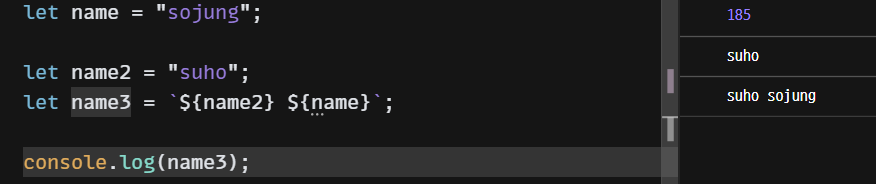
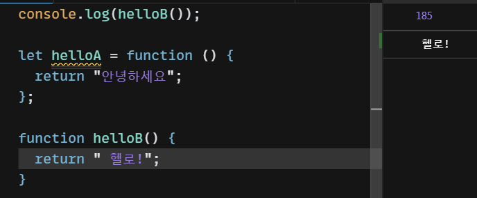
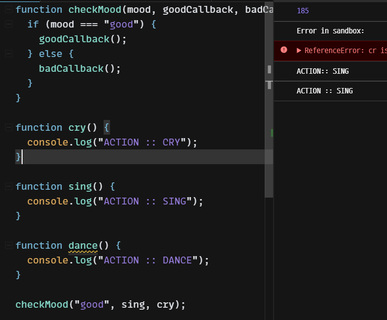
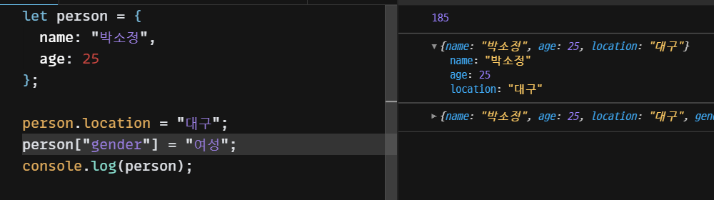
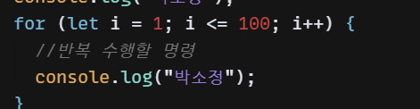

템플릿 리터럴

함수 표현식은 호이스팅이 일어나지 않고, 함수 선언식만 호이스팅이 일어난다!

콜백 함수 : 함수의 파라미터로 함수를 넘기는 것

점 표기법 / 괄호 표기법으로 property 추가 가능

1. 초기식 `let i = 1;` : 반복의 주체가 될 변수를 우리가 선언하게 해준다!
2. 조건 : 반복이 이 조건을 만족할 때만 돌아가게 해라!
3. 연산 : 반복이 한 번 수행될 때마다 해줄 연산!