템플릿 리터럴

함수 표현식은 호이스팅이 일어나지 않고, 함수 선언식만 호이스팅이 일어난다!

콜백 함수 : 함수의 파라미터로 함수를 넘기는 것

점 표기법 / 괄호 표기법으로 property 추가 가능

1. 초기식 `let i = 1;` : 반복의 주체가 될 변수를 우리가 선언하게 해준다!
2. 조건 : 반복이 이 조건을 만족할 때만 돌아가게 해라!
3. 연산 : 반복이 한 번 수행될 때마다 해줄 연산!

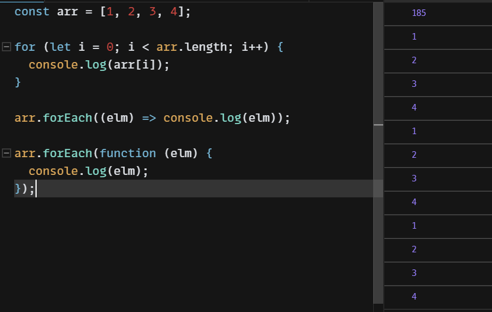

- forEach : 배열의 하나하나를 호출

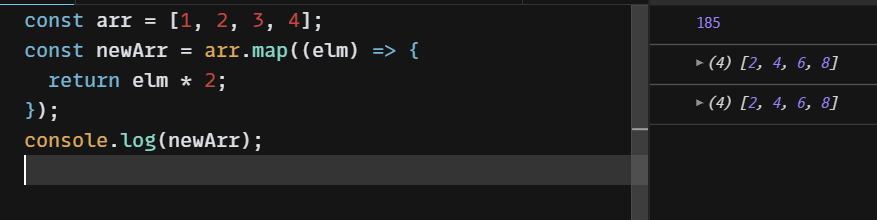

- map: 배열 하나하나 호출. 어떤 연산 작업을 통해 나온 결과값만을 리턴한다.

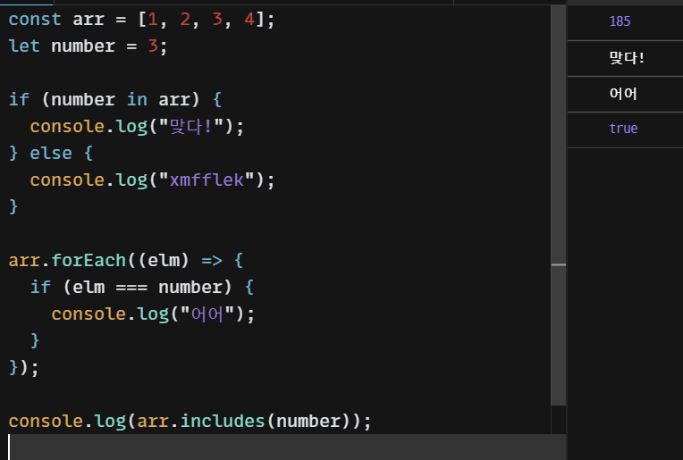

- includes : === 연산을 통해서 값을 찾는 함수

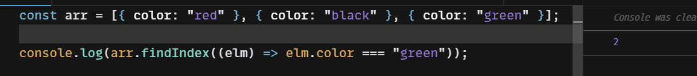

- findIndex : 인덱스 반환. 없는 경우 -1 반환

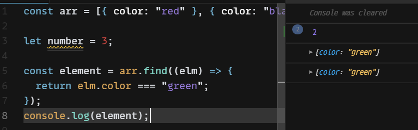

- find : 

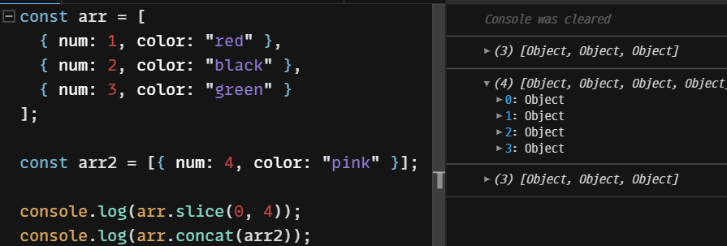

- concat : arr 뒤에 arr2를 붙이는 것.
- slice: 자르는 것

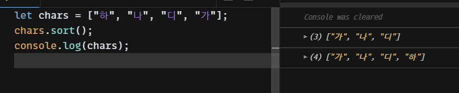

- sort : 배열 순서 정리

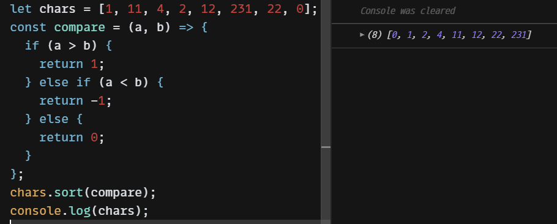

- 다만 sort로 했을 때 숫자형은 앞에서부터 받다보니 제대로 정렬이 안될수가 있다. 그런 경우, 비교 형식을 위와 하여 정렬해준다. 1은 a가 b보다 크므로 뒤에 위치한다는 뜻이다!

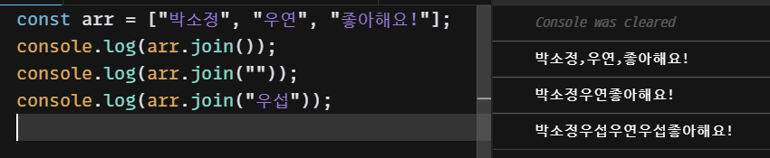

- join : 합치기!

----

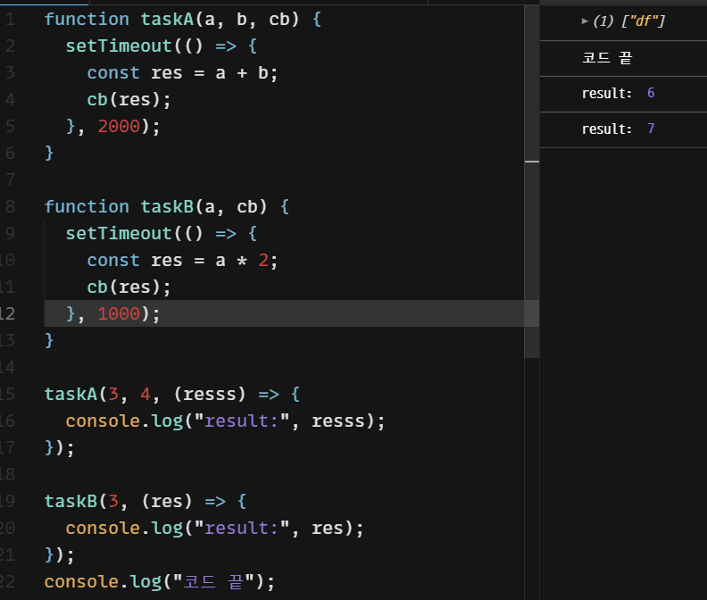

- 비동기는 setTimeout을 이용하여 사용 

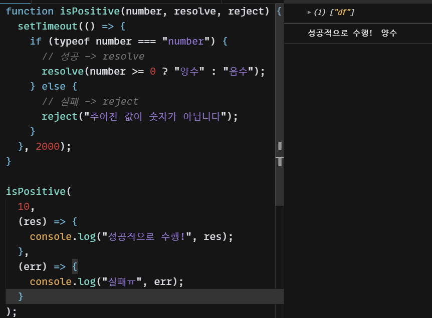

- 콜백함수

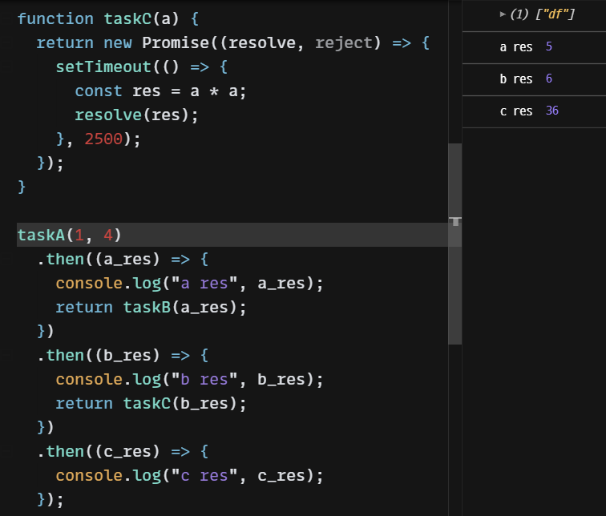

- Promise를 사용하여 콜백지옥 탈출하기