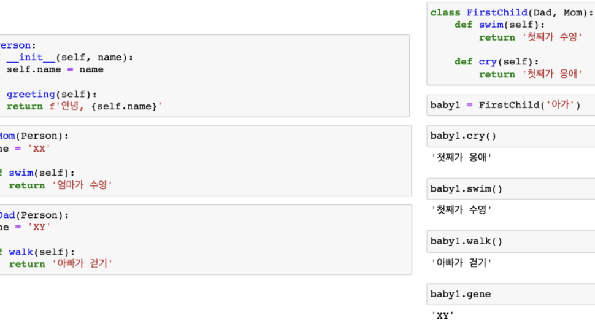
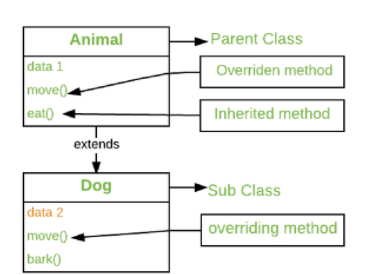

## OOP

### 객체지향 프로그래밍(OOP)

- OOP 기초
- 인스턴스
- 클래스
- 매소드


### 객체지향의 핵심개념

- 추상화
- 상속
- 다형성
- 캡슐화


-----


> 객체란?

- 객체(object)는 특정 타입의 인스턴스(instance)이다.

  - 123, 9900, 5는 모두 int의 인스턴스

  - 'hello', 'bye'는 모두 string의 인스턴스

  - [232,1345,2],[]는 모두 list의 인스턴스


- 객체의 특징

  - 타입(type) : 어떤 연산자(operator)와 조작(method)가 가능한가?

  - 속성(attribute) : 어떤 상태(데이터)를 가지는가?

  - 조작법(method) : 어떤 행위(함수)를 할 수 있는가?


- 객체 지향 프로그래밍이란?

= 프로그램을 여러 개의 독립된 객체들과 그 객체들 간의 상호작용으로 파악하는 프로그래밍


- 객체 지향 프로그래밍이 필요한 이유

= 현실 세계를 프로그램 설계에 반영(추상화)

```python
class Person:
    def __init__(self, name, gender):
        self.name = name
        self.gender = gender
        
    def greeting(self):
        print(f'안녕하세요, {self.name})입니다.
              
jimin = Person('지민','남자')
jimin.greeting()
              
# 안녕하세요, 지민입니다.
```

```python
class Rectangle:
    def __init__(self, x, y):
        self.x = y
        self.y = y
    def area(self):
        return self.x * self.y
    def circumference(self):
        return 2*(self.x + self.y)
    
r1 = Rectangle(10, 30)
r1.area
r1.circumference()

r2 = Rectangle(300, 20)
r2.area()
r2.circumference()

사각형 = 클래스(class)
각 사각형(r1, r2) = 인스턴스(instance)
사각형의 정보 = 속성(attribute)
	가로 길이, 세로 길이
사각형의 행동 = 메소드(method)
	넓이, 높이를 구한다.
```


- 객체지향의 장점(위키피디아)
  - 객체 지향 프로그래밍은 프로그램을 유연하고 변경이 용이하게 만들기에 대규모 소프트웨어 개발에 많이 사용된다.
  - 또한, 프로그래밍을 더 배우기 쉽게 하고 소프트웨어 개발과 보수를 간편하게 하며,
  - 보다 직관적인 코드 분석을 가능하게 하는 장점을 가지고 있다.


-----


> 클래스와 인스턴스


- 클래스 : 객체들의 분류(class)
- 인스턴스 : 하나하나의 실체/예(instance)

`파이썬은 모든 것이 객체, 모든 객체는 특정 타입의 인스턴스`


> 속성

: 특정 데이터 타입 / 클래스의 객체들이 가지게 될 상태/ 데이터를 의미

```python
class Person:
    def __init__(self, name):
        self.name = name

person1 = Person('지민')
person1.name

#'지민'
```


> 메소드

: 특정 데이터 타입 / 클래스의 객체에 공통적으로 적용 가능한 행위(함수)

```python
class Person:
    def talk(self):
        print('안녕')
    def eat(self, food):
        print(f'{food}를 냠냠')
        
person1= Person()
person1.talk()    # 안녕
person1.eat('피자')   # 피자를 냠냠
person1.eat('치킨')   # 치킨를 냠냠
```


> 객체 비교하기

- ==
  - 동등한(equal)
  - 변수가 참조하는 객체가 동등한(내용이 같은) 경우 True
  - 두 객체가 같아 보이지만 실제로 동일한 대상을 가리키고 있다고 확인해 준 것은 아님
- is
  - 동일한(identical)
  - 두 변수가 동일한 객체를 가리키는 경우 True


-----


### 인스턴스

> 인스턴스 변수란?

- 인스턴스가 개인적으로 가지고 있는 속성(attribute)
- 각 인스턴스들의 고유한 변수

- 생성자 메소드에서 self.<name>으로 정의
- 인스턴스가 생성된 이후 <instance>.<name>으로 접근 및 할당

```python
class Person:
    def __init__(self, name):
        self.name = name    # 인스턴스 변수 정의
john = Person('john')       # 인스턴스 변수 접근 및 할당
print(john.name)            # john
john.name = 'John Kim'      # 인스턴스 변수 접근 및 할당
print(john.name)            # John Kim
```


> 인스턴스 메소드란?

- 인스턴스 변수를 사용하거나, 인스턴스 변수에 값을 설정하는 메소드
- 클래스 내부에 정의되는 메소드의 기본
- 호출 시, 첫번째 인자로 인스턴스 자기자신(self)이 전달됨

```python
class MyClass:
    def instance_method(self, arg1, ...):
        
my_instance = MyClass()
my_instance.instance_method(...)
```


> self

- 인스턴스 자기자신
- 파이썬에서 인스턴스 메소드는 호출 시 첫번째 인자로 인스턴스 자신이 전달되게 설계
  - 매개변수 이름으로 self를 첫번째 인자로 정의
  - 다른 단어로 써도 작동하지만, 파이썬의 암묵적인 규칙


> 생성자(constructor) 메소드

- 인스턴스 객체가 생성될 때 자동으로 호출되는 메소드
- 인스턴스 변수들의 초깃값을 설정
  - 인스턴스 생성
  - __ init __ 메소드 자동 호출

```python
class Person:
    def __init__(self):
        print('인스턴스가 생성되었습니다.')
        
person1 = Person()       # 인스턴스가 생성되었습니다.

class Person:
    def __init__(self, name):
        print(f'인스턴스가 생성되었습니다. {name}')
        
person2 = Person('지민')  # 인스턴스가 생성되었습니다. 지민
```


> 소멸자(destructor) 메소드

- 인스턴스 객체가 소멸(파괴)되기 직전에 호출되는 메소드

```python
class Person:
    def __del__(self):
        print('인스턴스가 사라졌습니다.')
        
person1 = Person()
del Person1       # 인스턴스가 사라졌습니다.
```


> 매직 메소드

- Double underscore(__)가 있는 메소드는 특수한 동작을 위해 만들어진 메소드로, 스페셜 메소드 혹은 매직 메소드라고 불림
- 특정 상황에 자동으로 불리는 메소드
- 예시
  - __ str __ (self), __ __ len(self) __, __ __ repr __(self)
  - __ lt __ (self, other), __ le __ (self, other), __ eq __ (self, other)
  - __ gt __ (self, other), __ ge __ (self, other), __ ne __ (self, other)

- 객체의 특수 조작 행위를 지정(함수, 연산자 등)
  - __ str __ : 해당 객체의 출력 형태를 지정
    - 프린트 함수를 호출할 때, 자동으로 호출
    - 어떤 인스턴스를 출력하면 __ str __ 의 return 값이 출력
  - __ gt __ : 부등호 연산자(>, greater than)

```python
class Circle:
    def __init__(self, r):
        self.r = r
    def area(self):
        return 3.14 * self.r * self.r
   	def __str__(self):
        return f'[원] radius: {self.r}'
    def __gt__(self, other):
        return self.r > other.r
    
c1 = Circle(10)
c2 = Circle(1)
print(c1)					# [원] radius: 10
print(c2)					# [원] radius: 1
c1 > c2						# True
c1 < c2						# False
```


----


### 클래스

> 클래스 변수

- 한 클래스의 모든 인스턴스라도 똑같은 값을 가지고 있는 속성
- 클래스 이름 대신 인스턴스 이름을 쓰면? > 인스턴스 변수

- 클래스 속성(attribute) : 한 클래스의 모든 인스턴스라도 똑같은 값을 가지고 있는 속성
- <classname>.<name>으로 접근 및 할당

```python
class Circle:
    pi = 3.14			# 클래스 변수 정의
    
c1 = Circle()
c2 = Circle()

print(Circle.pi)		# 3.14
print(c1.pi)		# 3.14
print(c2.pi)		# 3.14
```


> 클래스 메소드

- 클래스가 사용할 메소드
- @classmethod 데코레이터를 사용하여 정의
  - 데코레이터 : 함수를 어떤 함수로 꾸며서 새로운 기능을 부여
- 호출 시, 첫번째 인자로 클래스(cls)가 전달됨

```python
class MyClass:
    @classmethod
    def class_method(cls, arg1, ...):
MyClass.class_method(...)
```


> 스태틱 메소드

- 인스턴스 변수, 클래스 변수를 전혀 다루지 않는 메소드
- 속성을 다루지 않고 단지 기능(행동)만을 하는 메소드를 정의할 때, 사용

- 클래스가 사용할 메소드
- @staticmethod 데코레이터를 사용하여 정의
- 호출 시, 어떠한 인자도 전달되지 않음(클래스 정보에 접근/ 수정 불가)

```python
class MyClass:
    @staticmethod
    def class_method(cls, arg1, ...):
MyClass.class_method(...)
```


> 인스턴스와 클래스 간의 이름 공간(namespace)

- 클래스를 정의하면, 클래스와 해당하는 이름 공간 생성
- 인스턴스를 만들면, 인스턴스 객체가 생성되고 이름 공간 생성
- 인스턴스에서 특정 속성에 접근하면, 인스턴스-클래스 순으로 탐색


> 인스턴스와 클래스 간의 이름 공간(namespace)

```python
# Person 정의
class Person:
    name = 'unknown'
    def talk(self):
        print(self.name)
        
p1 = Person()
p1.talk()					# unknown
# p1은 인스턴스 변수가 정의되어 있지 않아 클래스 변수(unknown)가 출력됨

# p2 인스턴스 변수 설정 전/후
p2 = Person()
p2.talk()					# unknown
p2.name = 'Kim'
p2.talk()					# Kim
# p2는 인스턴스 변수가 정의되어 인스턴스 변수(Kim)가 출력됨

print(Person.name)			# unknown
print(p1.name)				# unknown
print(p1.name)				# Kim
# Person 클래스의 값이 Kim으로 변경된 것이 아닌 p2 인스턴스의 이름 공간에 name이 Kim으로 저장됨
```


----


### 메소드 정리

- 인스턴스 메소드
  - self 매개변수를 통해 동일한 객체에 정의된 속성 및 다른 메소드에 자유롭게 접근
  - 클래스자체에도 접근 가능 > 인스턴스 메소드가 클래스 상태를 수정할 수도 있음
- 클래스 메소드
  - 클래스를 가리키는 cls 매개 변수를 받음
  - cls 인자에만 접근할 수 있기 때문에 객체 인스턴스 상태를 수정할 수 없음

- 스태틱 메소드
  - 임의개수의 매개변수를 받을 수 있지만, self나 매개변수는 사용하지 않음
  - 객체 상태나 클래스 상태를 수정할 수 없음
  - 일반 함수처럼 동작하지만 클래스의 이름공간에 귀속됨
    - 주로 해당 클래스로 한정하는 용도로 사용


```python
class MyClass:
    def method(self):
        return 'instance method', self
    
    @classmethod
    def classmethod(cls):
        return 'class method', cls
    
    @staticmethod
    def staticmethod():
        return 'static method'
```


-----


### 객체 지향의 핵심개념 4가지

- 추상화
- 상속
- 다형성
- 캡슐화


> 추상화


```python
# 학생(Student)을 표현하기 위한 클래스를 생성합니다.

class Student:
    def __init__(self, name, age, gpa) :
        self.name = name
        self.age = age
        self.gpa = gpa
        
    def talk(self):
        print(f'반갑습니다. {self.name}입니다.')
        
    def study(self):
        self.gpa += 0.1
```

```python
# 교수(Professor)을 표현하기 위한 클래스를 생성합니다.

class Professor:
    def __init__(self, name, age, department):
        self.name = name
        self.age = age
        self.department = department
        
    def talk(self):
        print(f'반갑습니다. {self.name}입니다.')
        
    def teach(self):
        self.age += 1
```

```python
#위의 class Student와 Professor은 여기에 포함됩니다.

class Person:
    def __init__(self, name, age):
        self.name = name
        self.age = age
        
    def talk(self):
        print(f'반갑습니다. {self.name}입니다.')
```


> 상속

- 두 클래스 사이 부모-자식 관계를 정립하는 것
- 클래스는 상속이 가능함
  - 모든 파이썬 클래스는 object를 상속받음
- 하위 클래스는 상위 클래스에 정의된 속성, 행동, 관계 및 제약 조건을 모두 상속받음
- 부모 클래스의 속성, 메소드가 자식 클래스에 상속되므로, 코드 재사용성이 높아짐


```python
class Person:
    def __init__(self, name, age):
        self.name = name
        self.age = age
        
    def talk(self):
        print(f'반갑습니다. {self.name}입니다.')
        
class Professor(Person):
    def __init__(self, name, age, department):
        self.name = name
        self.age = age
        self.department = department
        
class Student(Person):
    def __init__(self, name, age, gpa):
        self.name = name
        self.age = age
        self.gpa = gpa
        
        
p1 = Professor('박교수',49,'컴퓨터공학과')
s1 = Student('김학생',20,3.5)

# 부모 Person 클래스의 talk 메서드를 활용
p1.talk()				#반갑습니다. 박교수입니다.
s1.talk()				#반갑습니다. 김학생입니다.
```

- isinstance(object, classinfo)
  - classinfo의 instance거나 subclass인 경우 True


- issubclass(class, classinfo)
  - class가 classinfo의 subclass면 True
  - classinfo는 클래스 객체의 튜플일 수 있으며, classinfo의 모든 항목을 검사

```python
issubclass(bool, int)						# True
issubclass(float, int)						# False
issubclass(Professor, Person)				# True
issubclass(Professor, (Person, Student))	# True
```


- super()
  - 자식클래스에서 부모클래스를 사용하고 싶은 경우

```python
class Person:
    def __init__(self, name, age, number, email):
        self.name = name
        self.age = age
        self.number = number
        self.email = email
        
class Student(Person):
    def __init__(self, name, age, number, student_id):
        # Person 클래스
        super().__init(name, age, number, email)
        self.student_id = student_id
```


상속 정리하자면

- 파이썬의 모든 클래스는 object로부터 상속됨
- 부모 클래스의 모든 요소(속성, 메소드)가 상속됨
- super()를 통해 부모 클래스의 요소를 호출할 수 있음
- 메소드 오버라이딩을 통해 자식 클래스에서 재정의 가능함
- 상속관계에서의 이름 공간은 인스턴스, 자식 클래스, 부모 클래스 순으로 탐색


> 다중 상속

- 두개 이상의 클래스를 상속받는 경우
- 상속 받은 모든 클래스의 요소를 활용 가능함
- 중복된 속성이나 메서드가 있는 경우 상속 순서에 의해 결정됨




- mro 메소드(Method Resolution Order)
  - 해당 인스턴스의 클래스가 어떤 부모 클래스를 가지는지 확인하는 메소드
  - 기존의 인스턴스 > 클래스 순으로 이름 공간을 탐색하는 과정에서 상속 관계에 있으면 인스턴스 > 자식 클래스 > 부모 클래스로 확장


> 다형성(Polymorphism)

- 여러 모양을 뜻하는 그리스어
- 동일한 메소드가 클래스에 따라 다르게 해동할 수 있음을 의미
- 즉, 서로 다른 클래스에 속해있는 객체들이 동일한 메시지에 대해 다른 방식으로 응답될 수 있음

- 메소드 오버라이딩
  - 상속받은 메소드를 재정의
    - 클래스 상속 시, 부모 클래스에서 정의한 메소드를 자식 클래스에서 변경
    - 부모 클래스의 메소드 이름과 기본 기능은 그대로 사용하지만, 특정 기능을 바꾸고 싶을 때 사용
    - 상속받은 클래스에서 같은 이름의 메소드로 덮어씀
    - 부모 클래스의 메소드를 실행시키고 싶은 경우 super를 활용




> 캡슐화

- 객체의 일부 구현 내용에 대한 외부로부터 직접적인 액세스를 차단
  - 예시 : 주민등록번호
- 파이썬에서 암묵적으로 존재하지만, 언어적으로는 존재하지 않음

- Public Member
  - 언더바가 없이 시작하는 메소드나 속성
  - 어디서나 호출이 가능, 하위 클래스 override 허용
  - 일반적으로 작성되는 메소드와 속성의 대다수를 차지
- Protected Member
  - 언더바 1개로 시작하는 메소드나 속성
  - 암묵적 규칙에 의해 부모 클래스 내부와 자식 클래스에서만 호출 가능
  - 하위 클래스 override 허용
- Privated Member
  - 언더바 2개로 시작하는 메소드나 속성
  - 본 클래스 내부에서만 사용이 가능
  - 하위클래스 상속 및 호출 불가능(오류)
  - 외부 호출 불가능(오류)
- getter 메소드와 setter 메소드
  - 변수에 접근할 수 있는 메소드를 별도로 생성
    - getter 메소드 : 변수의 값을 읽는 메소드
      - @property 데코레이터 사용
    - setter 메소드 : 변수의 값을 설정하는 성격의 메소드
      - @변수.setter 사용


