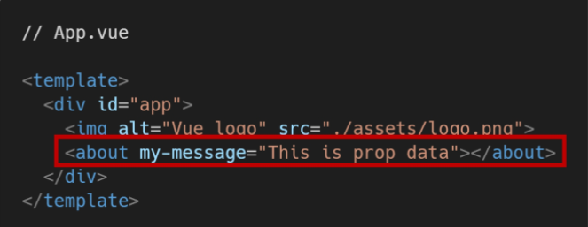

## Vue2

> Vue 프로젝트 구조

- node_modules
  - node.js 환경의 여러 의존성 모듈
- public/index.html
  - Vue 앱의 뼈대가 되는 파일
  - 실제 제공되는 단일 html 파일
- src/assets
  - webpack에 의해 빌드된 정적 파일
- src/components
  - 하위 컴포넌트들이 위치
- src/App.vue
  - 최상위 컴포넌트
- src/main.js
  - webpack이 빌드를 시작할 때 가장 먼저 불러오는 entry point
  - 실제 단일 파일에서 DOM과 data를 연결했던 것과 동일한 작업이 이루어지는 곳
  - Vue 전역에서 활용할 모듈을 등록할 수 있는 파일
- babel.config.js
  - babel 관련 설정이 작성된 파일
- package.json
  - 프로젝트의 종속성 목록과 지원되는 브라우저에 대한 구성 옵션이 포함
- package-lock.json
  - node_modules에 설치되는 모듈과 관련된 모든 의존성을 설정 및 관리
  - 팀원 및 배포 환경에서 정확히 동일한 종속성을 설치하도록 보장하는 표현
  - 사용할 패키지의 버전을 고정
  - 개발 과정 간의 의존성 패키지 충돌 방지

----

### Pass Props & Emit Events

> 컴포넌트 작성

- Vue app은 자연스럽게 중첩된 컴포넌트 트리로 구성됨

- 컴포넌트간 부모-자식 관계가 구성되며 이들 사이에 필연적으로 의사 소통이 필요함

- 부모는 자식에게 데이터를 전달(Pass props)하며, 자식은 자신에게 일어난 일을 부모에게 알림(Emit event)

  - 부모와 자식이 명확하게 정의된 인터페이스를 통해 격리된 상태를 유지할 수 있음

- ##### ✔️ props는 아래로, events는 위로!!!!

- 부모는 props를 통해 자식에게 `데이터`를 전달하고, 자식은 events를 통해 부모에게 `메시지`를 보냄

> 컴포넌트 구조

##### ❤️ 템플릿(HTML)

- HTML의 body 부분
- 각 컴포넌트를 작성

##### 🧡스크립트(JavaScript)

- JavaScript가 작성되는 곳
- 컴포넌트 정보, 데이터, 메서드 등 vue 인스턴스를 구성하는 대부분이 작성됨

##### 💙스타일(CSS)

- CSS가 작성되며 컴포넌트의 스타일을 담당

> 컴포넌트 등록 3단계

> Props

- props는 부모(상위) 컴포넌트의 정보를 전달하기 위한 사용자 지정 특성
- 자식(하위) 컴포넌트는 props 옵션을 사용하여 수신하는 props를 명시적으로 선언해야 함
- 즉, 데이터는 props 옵션을 사용하여 자식 컴포넌트로 전달됨
- 주의!
  - 모든 컴포넌트 인스턴스에는 자체 격리된 범위가 있음
  - 즉, 자식 컴포넌트의 템플릿에서 상위 데이터를 직접 참조할 수 없음

> Static Props 작성

- 자식 컴포넌트(About.vue)에 보낼 prop 데이터 선언
- prop-data-name="value"

- 수신할 prop 데이터를 명시적으로 선언 후 사용

> Dynamic Props 작성

- v-bind directive를 사용해 부모의 데이터의 props를 동적으로 바인딩
- 부모에서 데이터가 업데이트될 때마다 자식 데이터로도 전달됨

- 마찬가지로 수신할 prop 데이터를 명시적으로 선언 후 사용

> Props 이름 컨벤션

- during declaration(선언 시) = camelCase
- im template(HTML) = kebab-case

#### 👉 컴포넌트의 data는 반드시 함수여야 함

- 기본적으로 각 인스턴스는 모두 같은 data 객체를 공유하므로 새로운 data 객체를 반환(return)하여야 함

> Props 시 자주하는 실수

- Static 구문을 사용하여 숫자를 전달하려고 시도하는 것
- 실제 JavaScript 숫자를 전달하려면 값이 JavaScript 표현식으로 평가되도록 v-bind를 사용해야함

> 단방향 데이터 흐름

- 모든 props는 하위 속성과 상위 속성 사이의 `단방향` 바인딩을 형성
- 부모의 속성이 변경되면 자식 속성에게 전달되지만, 반대 방향으로는 안됨
  - 자식 요소가 의도치 않게 부모 요소의 상태를 변경하여 앱의 데이터 흐름을 이해하기 어렵게 만드는 일을 방지
- 부모 컴포넌트가 업데이트될 때마다 자식 요소의 모든 prop들이 최신 값으로 업데이트됨

> Emit event

- "Listening to Child Components Events"
- `$emit(eventName)`
  - 현재 인스턴스에서 이벤트를 트리거
  - 추가 인자는 리스너의 콜백 함수로 전달
- 부모 컴포넌트는 자식 컴포넌트가 사용되는 템플릿에서 v-on을 사용하여 자식 컴포넌트가 보낸 이벤트를 청취(v-on을 이용한 사용자 지정 이벤트)

> event 이름 컨벤션

- 컴포넌트 및 props와는 달리, 이벤트는 자동 대소문자 변환을 제공하지 않음
- HTML의 대소문자 구분을 위해 DOM 템플릿의 v-on 이벤트 리스너는 항상 자동으로 소문자 변환되기 때문에 v-on:myEvent는 자동으로 v-on:myevent로 변환
- 이러한 이유로 이벤트 이름에는 항상 `kebob-case`를 사용하는 것을 권장

-----

### Vue Router

> Vue Router

- 라우트(route)에 컴포넌트를 매핑한 후, 어떤 주소에서 렌더링할 지 알려줌
- SPA 상에서 라우팅을 쉽게 개발할 수 있는 기능을 제공
- router = 위치에 대한 최적의 경로를 지정하며, 이 경로를 따라 데이터를 다음 장치로 전향시키는 장치

#### ⭐Vue router가 필요한 이유

- SPA 등장 이전
  - 서버가 모든 라우팅을 통제
  - 요청 경로에 맞는 HTML를 제공
- SPA 등장 이후
  - 서버는 index.html 하나만 제공
  - 이후 모든 처리는 HTML 위에서 JS 코드를 활용해 진행
  - 즉, 요청에 대한 처리를 더 이상 서버가 하지 않음
- 라우팅 처리 차이
  - SSR
    - 라우팅에 대한 결정권을 서버가 가짐
  - CSR
    - 클라이언트는 더 이상 서버로 요청을 보내지 않고 응답받은 HTML 문서 안에서 주소가 변경되면 특정 주소에 맞는 컴포넌트를 렌더링
    - 라우팅에 대한 결정권을 클라이언트가 가짐
- 결국 Vue Router는 라우팅의 결정권을 가진 Vue.js에서 라우팅을 편리하게 할 수 있는 Tool을 제공해주는 라이브러리

> Vue Router로 인한 변화

- App.vue 코드
- router/index.js 생성 = 라우트에 관련된 정보 및 설정이 작성되는 곳
- views 디렉토리 생성

> Vue Router

- < router-link >
  - 사용자 네비게이션을 가능하게 하는 컴포넌트
  - 목표 경로는 'to' prop으로 지정됨
  - HTML5 히스토리 모드에서 router-link는 클릭 이벤트를 차단하여 브라우저가 페이지를 다시 로드하지 않도록 함
  - a 태그지만 우리가 알고 있는 GET 요청을 보내는 a 태그와 조금 다르게, 기본 GET 요청을 보내는 이벤트를 제거한 형태로 구성됨

- < router-views >
  - 주어진 라우트에 대해 일치하는 컴포넌트를 렌더링하는 컴포넌트
  - 실제 component가 DOM에 부착되어 보이는 자리를 의미
  - router-link를 클릭하면 해당 경로와 연결되어 있는 index.js에 정의한 컴포넌트가 위치

> History mode

- HTML History API를 사용해서 router를 구현한 것
- 브라우저의 히스토리는 남기지만 실제 페이지는 이동하지 않는 기능을 지원
- 즉, 페이지를 다시 로드하지 않고 URL을 탐색할 수 있음
  - SPA의 단점 중 하나인 "URL이 변경되지 않는다"를 해결

> History API

- DOM의 Window 객체는 history 객체를 통해 브라우저의 세션 기록에 접근할 수 있는 방법을 제공
- history 객체는 사용자를 자신의 방문 기록 앞과 뒤로 보내거나, 기록의 특정 지점으로 이동하는 등 유용한 메서드와 속성을 가짐

> Named Routes

- 이름을 가지는 라우트
- 명명된 경로로 이동하려면 객체를 vue-router 컴포넌트 요소의 prop에 전달

> 프로그래밍 방식 네비게이션

- < router-link >를 사용하여 선언적 탐색을 위한 a 태그를 만드는 것 외에도, router의 인스턴스 메서드를 사용하여 프로그래밍 방식으로 같은 작업을 수행할 수 있음

- Vue 인스턴스 내부에서 라우터 인스턴스에 `$router`로 접근할 수 있음
- 따라서 다른 URL로 이동하려면 `this.$router.push`를 호출할 수 있음
  - 이 메서드는 새로운 항목을 히스토리 스택에 넣기 때문에 사용자가 브라우저의 뒤로 가기 버튼을 클릭하면 이전 URL로 이동하게 됨
- < router-link >를 클릭할 때 내부적으로 호출되는 메서드이므로 < router-link :to="..." >를 클릭하면, `router.push(...)`를 호출하는 것과 같음

> components와 views

- 기본적으로 작성된 구조에서 components 폴더와 views 폴더 내부에 각기 다른 컴포넌트가 존재하게 됨
- 컴포넌트를 작성해 갈 때 정해진 구조가 있는 것은 아니며, 주로 아래와 같이 구조화하여 활용함
- `App.vue`
  - 최상위 컴포넌트
- `views/`
  - router(index.js)에 매핑되는 컴포넌트를 모아두는 폴더
  - ex) App 컴포넌트 내부에 AboutView & HomeView 컴포넌트 등록
- `components/`
  - router에 매핑된 컴포넌트 내부에 작성하는 컴포넌트를 모아두는 폴더
  - ex) Home 컴포넌트 내부에 HelloWorld 컴포넌트 등록