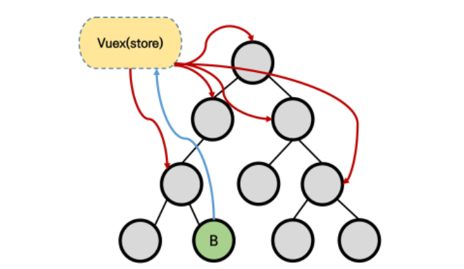
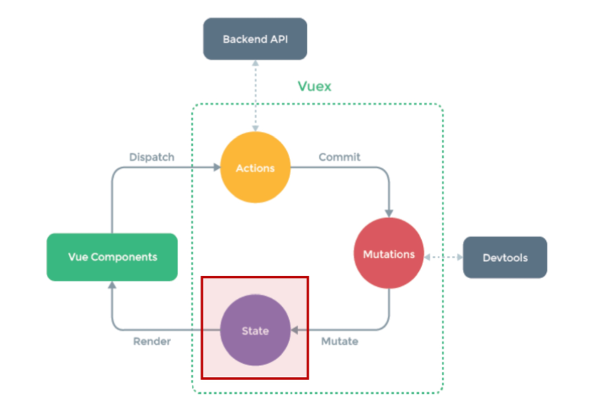
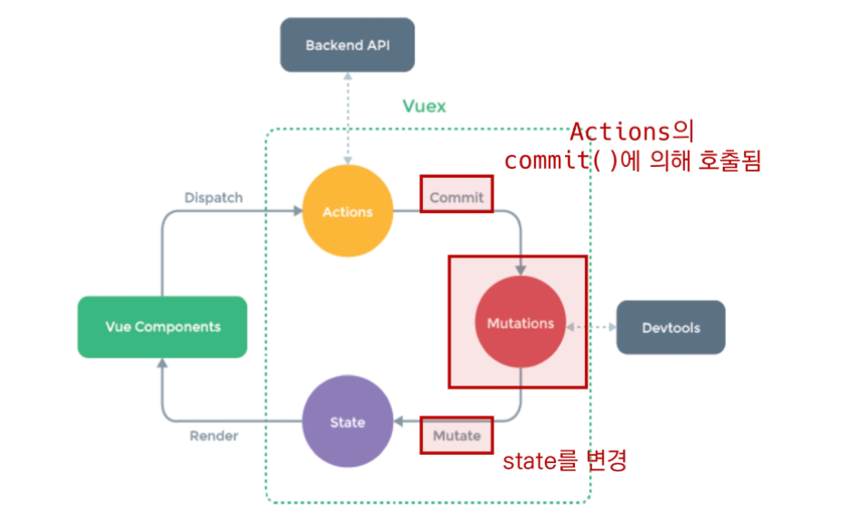
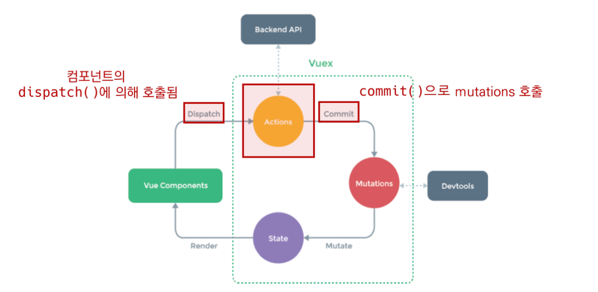
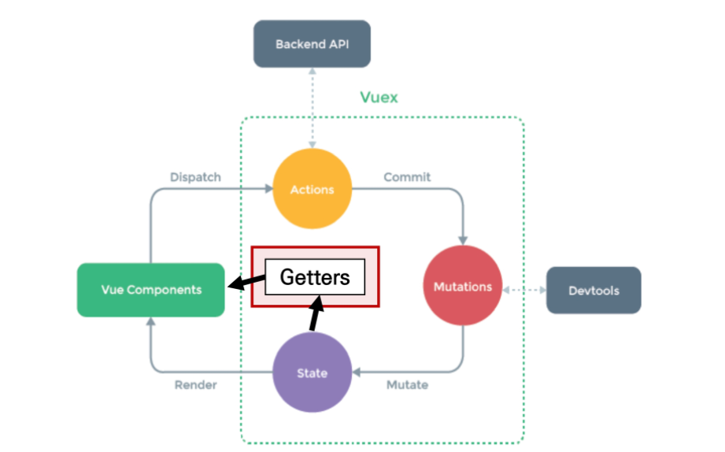

## Vuex

> Vuex

- "Statement management pattern + Library"
  - 상태 관리 패턴 + 라이브러리
- 상태(state)를 전역 저장소로 관리할 수 있도록 지원하는 라이브러리
  - 상태가 예측 가능한 방식으로만 변경될 수 있도록 보장하는 규칙 설정
  - 애플리케이션의 모든 컴포넌트에 대한 `중앙 집중식 저장소` 역할
- Vue의 공식 devtools와 통합되어 기타 고급 기능을 제공

> 상태 관리 패턴

- 컴포넌트의 공유된 상태를 추출하고 이를 전역에서 관리하도록 함
- 컴포넌트는 커다란 view가 되며 모든 컴포넌트는 트리에 상관없이 상태에 액세스하거나 동작을 트리거 할 수 있음
- 상태 관리 및 특정 규칙 적용과 관련된 개념을 정의하고 분리함으로써 코드의 구조와 유지 관리 기능 향상

> 기존 Pass props & Emit event

- 각 컴포넌트는 독립적으로 데이터를 관리
- 데이터는 단방향 흐름으로 부모 -> 자식 간의 전달만 가능하며 반대의 경우 이벤트를 트리거
- 장점 : 데이터의 흐름을 직관적으로 파악 가능
- 단점 : 컴포넌트 중첩이 깊어지는 경우 동위 관계의 컴포넌트로의 데이터 전달이 불편해짐

> Vuex management pattern

- 중앙 저장소(store)에 state를 모아놓고 관리
- 규모가 큰( 컴포넌트 중첩이 깊은) 프로젝트에서 매우 효율적
- 각 컴포넌트에서는 중앙 집중 저장소의 state만 신경 쓰면 됨
  - 동일한 state를 공유하는 다른 컴포넌트들도 동기화됨

----

### Vuex 핵심 컨셉 4가지

#### ❤️ State

- "중앙에서 관리하는 모든 상태 정보(data)"
  - Vuex는 single state tree를 사용
  - 즉, 이 단일 객체는 모든 애플리케이션 상태를 포함하는 "원본 소스(single source of truth)"의 역할을 함
  - 이는 각 애플리케이션마다 하나의 저장소만 갖게 된다는 것을 의미함
- 각 컴포넌트는 이제 Vuex Store에서 state 정보를 가져와 사용

#### 💛Mutations

- "실제로 state를 변경하는 유일한 방법"
- mutation의 handle(핸들러 함수)는 반드시 동기적이어야 함
  - 비동기적 로직(ex.콜백 함수)은 state가 변화하는 시점이 의도한 것과 달라질 수 있으며, 콜백이 실제로 호출될 시기를 알 수 있는 방법이 없음
- 첫번째 인자로 항상 `state`를 받음
- Actions에서 `commit()` 메서드에 의해 호출됨

#### 💚 Actions

- Mutations와 유사하지만,
  - state를 변경하는 대신 mutations를 `commit()` 메서드로 호출해서 실행
  - mutations와 달리 비동기 작업이 포함될 수 있음
- `context` 객체 인자를 받음
  - context 객체를 통해 store/index.js 파일 내에 있는 모든 요소의 속성 접근 & 메서드 호출이 가능
  - 단, state를 직접 변경하지 않음
- 컴포넌트에서 `dispatch()` 메서드에 의해 호출됨
- Actions를 통해 state를 조작할 수도 있지만, state는 오로지 Mutations을 통해서만 조작해야함 > `명확한 역할 분담`을 통해 서비스 규모가 커져도 state를 올바르게 관리하기 위함이다.

#### 💙 Getters

- state를 변경하지 않고 활용하여 계산을 수행(computed 속성과 유사)
  - compute를 사용하는 것처럼 getters는 저장소의 상태(state)를 기준으로 계산
- computed 속성과 마찬가지로 getters의 결과는 state 종속성에 따라 캐시(cached)되고, 종속성이 변경된 경우에만 다시 재계산됨
- getters 자체가 state를 변경하지는 않음
  - state를 특정한 조건에 따라 구분(계산)만 함
  - 즉, 계산된 값을 가져옴

-----

### Component Binding Helper

- JS Array Helper Method를 통해 배열 조작을 편하게 하는 것과 유사
- 논리적인 코드 자체가 변하는 것이 아니라 "쉽게" 사용할 수 있도록 되어 있다.
- 종류
  - mapState
  - mapGetters
  - mapActions
  - mapMutations
  - createNamespacedHelpers

> mapState

- computed와 Store의 state를 매핑
- Vuex Store의 하위 구조를 반환하여 component 옵션을 생성함
- 매핑된 computed 이름이 state 이름과 같을 때 문자열 배열을 전달 할 수 있음
- 다른 computed 값을 함께 사용할 수 없기 때문에 최종 객체를 computed에 전달할 수 이도록 객체 전개 연산자(Object Spread Operator)로 객체를 복사하여 작성

> mapGetters

- Computed와 Getter를 매칭
- getters를 객체 전개 연산자(Object Spread Operator)로 계산하여 추가
- 해당 컴포넌트 내에서 매핑하고자 하는 이름이 index.js에 정의해 놓은 getters의 이름과 동일하며 배열의 형태로 해당 이름만 문자열로 추가

> mapActions

- action을 전달하는 컴포넌트 method 옵션을 만듦
- actions를 객체 전개 연산자(Object Spread Operator)로 계산하여 추가하기