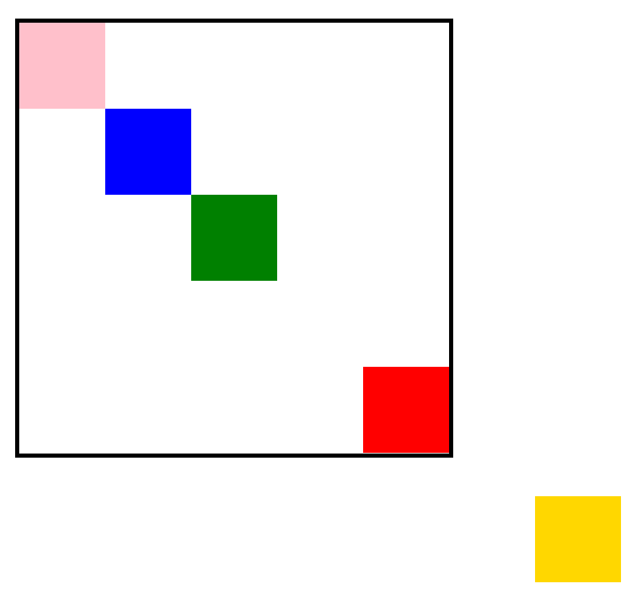
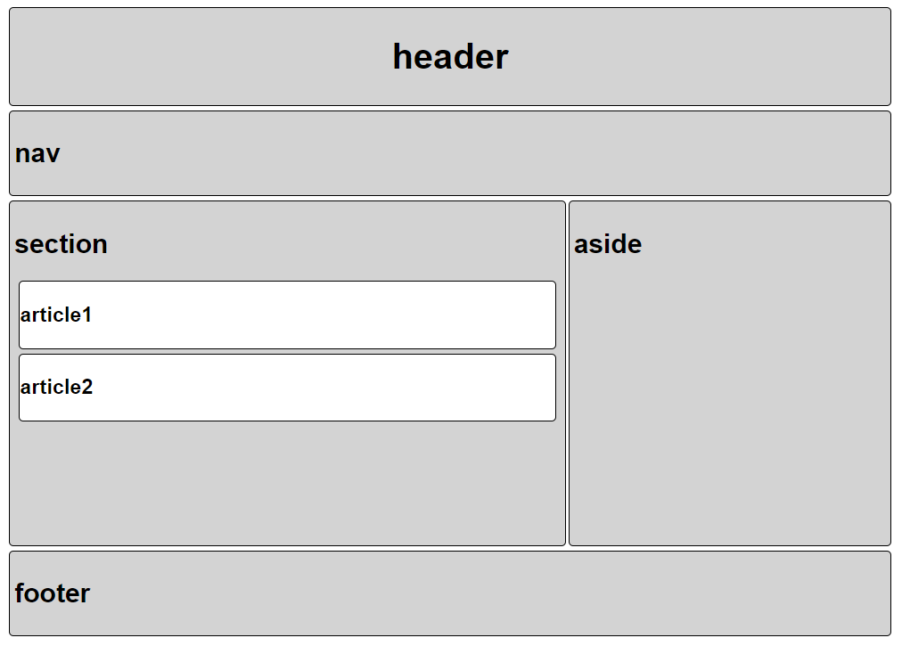

### 작은 박스 배치하기

```html
<!DOCTYPE html>
<html lang="ko">
<head>
  <meta charset="UTF-8">
  <meta name="viewport" content="width=device-width, initial-scale=1.0">
  <title>BOX Model Practice</title>
  <link rel="stylesheet" href="box_model.css">
</head>
<body>
  <div class="big-box">
    <div class="small-box" id="red"></div>
    <div class="small-box" id="gold"></div>
    <div class="small-box" id="green"></div>
    <div class="small-box" id="blue"></div>
    <div class="small-box" id="pink"></div>
  </div>
</body>
</html>
```

```css
.big-box {
  position: relative;
  margin: 100px auto 500px;
  border: 5px solid black;
  width: 500px;
  height: 500px;
}

.small-box {
  width: 100px;
  height: 100px;
}

#red {
  background-color: red;
  /* 큰 사각형 내부의 우측 하단 모서리에 빨간 사각형 위치시키기 */
  position: absolute;
  top: 400px;
  left: 400px;
}

#gold {
  background-color: gold;
  /* 브라우저의 하단에서 50px, 우측에서 50px 위치에 고정하기 */
  position: fixed;
  bottom: 50px;
  right: 50px;
}

#green {
  background-color: green;
  /* 큰 사각형의 가운데 위치시키기 */
  position: absolute;
  top: 200px;
  left: 200px;
}

#blue {
  background-color: blue;
  /* 큰 사각형 좌측 상단 모서리에서 100px, 100px 띄우기 */
  position: relative;
  top: 100px;
  left: 100px;

#pink {
  background-color: pink;
  /* 큰 사각형 내부의 좌측 상단 모서리로 옮기기*/
  position: absolute;
  top: 0;
}
```



기본적으로 이렇게 구성이 된다, 이렇게 이해를 하면 된다.

top, right, bottom, left 값에 대해서 익숙해지기


### 전체 배치 

```html
<!DOCTYPE html>
<html lang="ko">
<head>
  <meta charset="UTF-8">
  <meta name="viewport" content="width=device-width, initial-scale=1.0">
  <link rel="stylesheet" href="semantic.css">
  <title>Layout Practice</title>
</head>
<body>
  <div class="total">
    <header class="bg-lightgrey p-4 m-4 heading-center sem-border sem-border-radius">
      <h1>header</h1>
    </header>
    <nav class="bg-lightgrey p-4 m-4 ws-nav sem-border sem-border-radius">
      <h2>nav</h2>
    </nav>
    <div class="clearfix">
      <section class="bg-lightgrey p-4 sec-w-h sem-border sem-border-radius">
        <h2>section</h2>
        <article class="bg-white ws-article m-4 sem-border sem-border-radius">
          <h3>article1</h3>
        </article>
        <article class="bg-white ws-article m-4 sem-border sem-border-radius">
          <h3>article2</h3>
        </article>
      </section>
      <aside class="bg-lightgrey p-4 asi-w-h sem-border sem-border-radius">
        <h2>aside</h2>
      </aside>
    </div>  
    <footer class="bg-lightgrey p-4 m-4 ws-footer sem-border sem-border-radius">
      <h2>footer</h2>
    </footer>
  </div>
</body>
</html>
```

```css
body {
  font-family: Arial;
  width: 800px;
}

section {
  float: left;
  margin-left: 4px;
}

aside { 
  float: right;
  margin-right: 4px;
}

.clearfix::after {
  content: "";
  display: block;
  clear: both;
}

/* 여기서부터 작성하세요. */
/* 모든 스타일 요소를 ***클래스***로 만들어 작성 후 사용합니다. */

/* 1. article 태그는 white로 나머지 시멘틱 태그는 lightgrey로 배경색을 바꿔주세요. */
.bg-white {
  background-color: white;
}

.bg-lightgrey {
  background-color: lightgrey;
}
/* 2. header, nav, article, footer 태그의 margin을 4px로 만들어주세요. */
.m-4 {
  margin: 4px;
}
/* 3. semantic 태그의 padding을 4px로 만들어주세요. */
.p-4 {
  padding: 4px;
}
/* 4. h1 태그를 수평 중앙 정렬 시켜주세요. */
.heading-center {
  text-align: center;
}
/* 5. section 태그는 width 490px height 300px, 
   aside 태그는 width 280px height 300px로 만들어주세요.*/
.sec-w-h {
  width: 490px;
  height: 300px;
}

.asi-w-h {
  width: 280px;
  height: 300px;
}

/* 6. 모든 semantic 태그의 border 두께를 1px, 실선, 검은색으로 만들어주세요. */
.sem-border {
  border: 1px solid black
}

/* 7. 모든 semantic 태그의 border 모서리 반경을 4px로 만들어주세요. */
.sem-border-radius {
  border-radius: 4px;
}

/* 미리 css를 준비해두는 것이 key point!! 이렇게 하면 코드의 재사용성이 좋아진다. */
```




일일이 HTML 문서 상에서 class를 써서 꾸며줄수도 있지만, 위와 같이 미리 CSS 상에서 값들을 지정해주면 코드의 용이성이 좋아진다!!!!

- 회색 배경과 흰색 배경을 미리 작성한다.
- 각각 상자들의 border 값을 미리 작성한다.
- padding과 margin 값들을 미리 작성한다.

등등 class만 잘 작성해줘도 CSS가 길어지지 않고 HTML 문서 상에서도 충분히 레이아웃 배치가 가능하다!!!!

