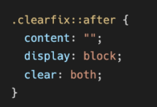
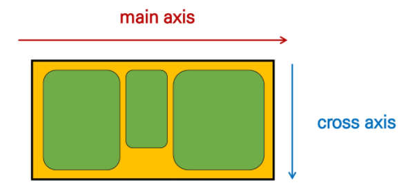
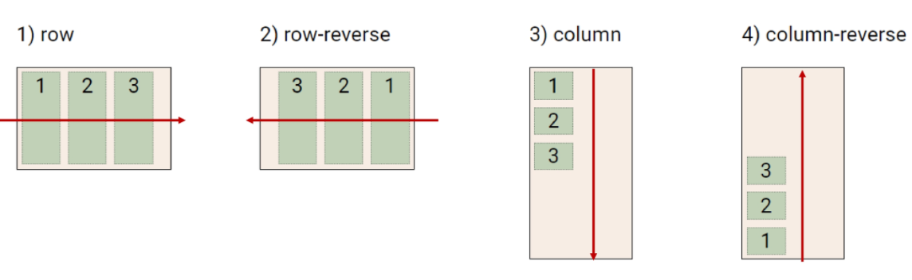
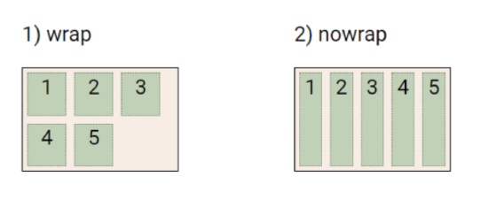
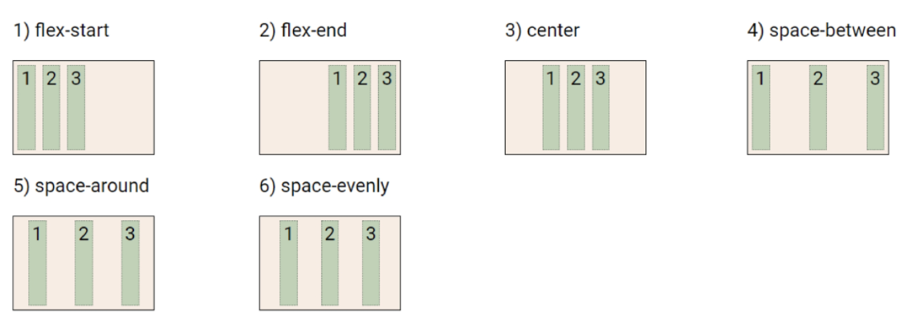
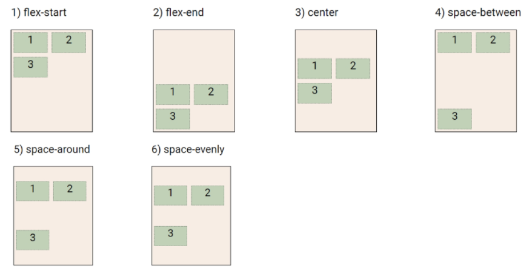
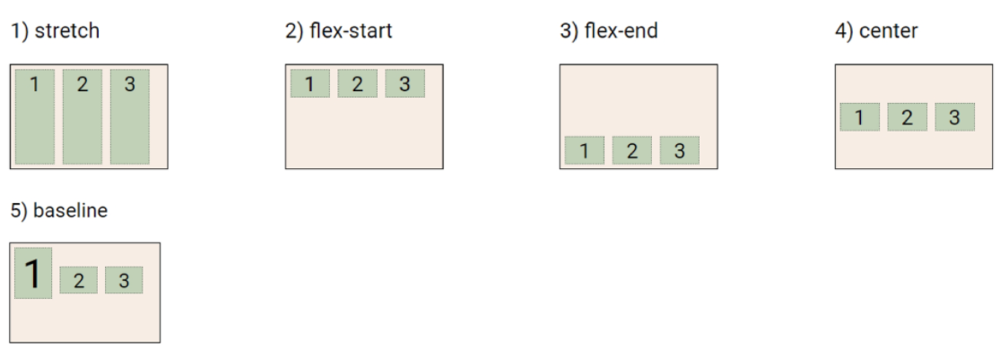
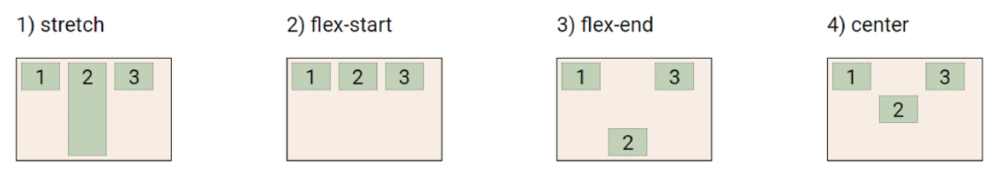
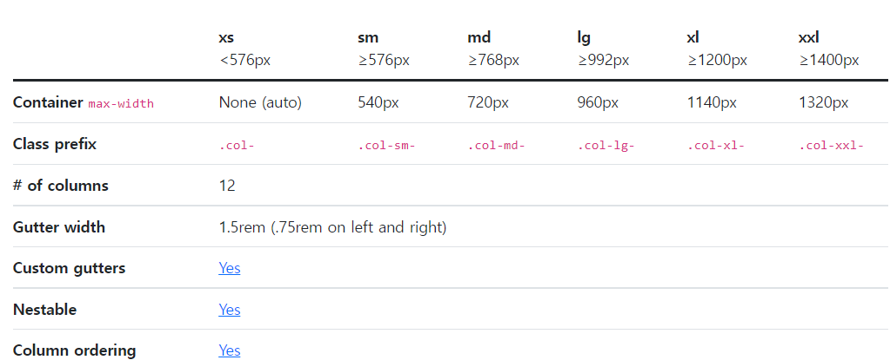

## WEB

💚https://flukeout.github.io/ = CSS 내 선택자 요소 공부하기 좋은 게임

❤https://flexboxfroggy.com/#ko = CSS내 flex 공부하기 좋은 게임

위 두 사이트 참조하기 매우 좋음!!!!!!!!!!!!

### float

- none: 기본값
- left : 요소를 왼쪽으로 띄움
- right : 요소를 오른쪽으로 띄움

> clearing float

Float는 Normal Flow에서 벗어나 부동 상태(떠 있음)

따라서, 이후 요소에 대하여 Float 속성이 적용되지 않도록 Clearing이 필수적임

- ::after : 선택한 요소의 맨 마지막 자식으로 가상 요소를 하나 생성
  - 보통 content 속성과 함께 짝지어, 요소에 장식용 콘텐츠를 추가할 때 사용
- clear 속성 부여

> Flexbox 구성 요소

- Flex Container(부모 요소)
  - flexbox 레이아웃을 형성하는 가장 기본적인 모델
  - Flex Item들이 놓여있는 영역
  - display 속성을 flex 혹은 inline-flex로 지정
- Flex Item(자식 요소)
  - 컨테이너에 속해 있는 컨텐츠(박스)

> Flex 속성

- 배치 설정
  - flex-direction
  - flex-wrap
- 공간 나누기
  - justify-content(main axis)
  - align-content(cross axis)
- 정렬
  - align-items(모든 아이템을 cross axis 기준으로)
  - align-self(개별 아이템)

> flex-direction

Main-axis 기준 방향 설정

> flex-wrap

아이템이 컨테이너를 벗어나는 경우 해당 영역 내에 배치되도록 설정

즉, 기본적으로 컨테이너 영역을 벗어나지 않도록 함

- nowrap(기본값) : 한 줄에 배치
- wrap : 넘치면 그 다음 줄로 배치

> justify-content

Main axis를 기준으로 공간 배분

> align-content

Cross axis를 기준으로 공간 배분(아이템이 한 줄로 배치되는 경우 확인할 수 없음)

> align-items

모든 아이템을 Cross axis를 기준으로 정렬

> align-self

개별 아이템을 Cross axis 기준으로 정렬

💥 주의 ! 해당 속성은 컨테이너에 적용하는 것이 아니라 개별 아이템에 적용

> 기타 속성

- flex-grow : 남은 영역을 아이템에 분배. 입력된 값만큼의 영역을 차지
- order : 배치 순서

> 그리드

https://getbootstrap.com/docs/5.1/layout/grid/

위 사이트를 보면 그리드 참조하기 매우 좋다!!!!!

 col-(xs)/ sm/ md/ lg/ xl/ xxl 는 뷰 사이즈에 맞춰 column이 반응하고,

뒤의 숫자는 12분할 중 어느만큼의 영역을 차지하냐는 것이다.