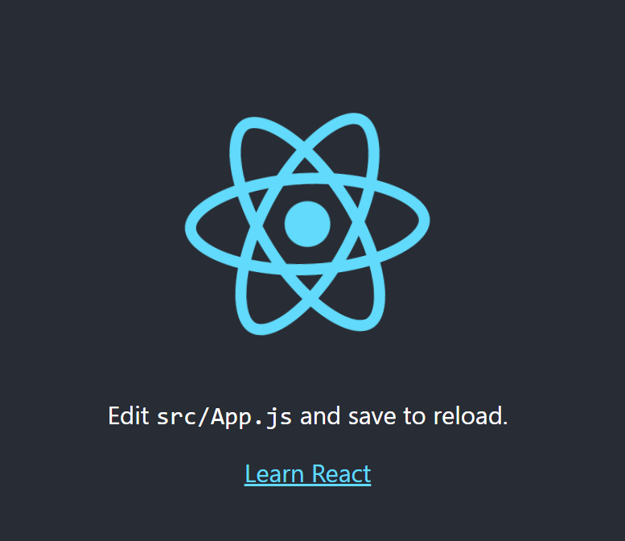

## REACT

> 시작하기

- `npm install -g create-react-app'` 입력하면 컴퓨터 전역적으로 설치가 된다.
- 만약 설치가 안되면 앞에 `sudo`를 붙이면 된다. 비밀번호도 설정하기
- `create-react-app -V`를 입력하면 현재 설치된 버전을 확인할 수 있다.
- `npx create-react-app`을 입력해서 설치하는 방법도 있다!
  - npm은 설치만 해주는 친구였다면
  - npx는 create-react-app이 돌아가는 그 한 번만 유지해준다.
    - 실행할 때마다 다운로드하기 때문에 최신의 상태로 유지가 된다.
    - 컴퓨터의 사용 공간을 크게 잡아먹지 않는다.

- `create-react-app` 명령어를 입력해서 개발환경을 구축한다.
- `npm run start`를 입력하면 웹 서버 실행 가능!

