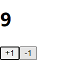
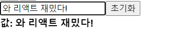
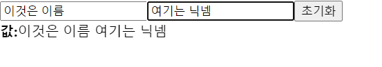

## REACT

-----

### 4. JSX

`JSX` : 리액트에서 생김새를 정의할 때 사용하는 문법. 얼핏보면 HTML 같이 생겼지만 실제로는 JavaScript이다.

- 태그는 무조건 마지막에 / 로 닫겨 있어야만 한다!

- 두 개 이상의 태그는 무조건 하나의 태그로 감싸져 있어야 한다!

  - 다만 단순히 감싸기 위하여 불필요한 div로 감싸는게 별로 좋지 않고 오히려 복잡해지기만 할 때가 있다.

  - 그럴 때는 리액트의 `Fragment`라는 것을 사용하면 된다.

  - ```react
    import React from 'react';
    import Hello from './Hello';
    
    function App() {
      return (
        <>
          <Hello />
          <div>안녕히계세요</div>
        </>
      );
    }
    
    export default App;
    ```

- JSX 내부에 자바스크립트 변수를 보여줘야 할 때는 `{}`로 감싸서 보여준다.

  - ```react
    import React from 'react';
    import Hello from './Hello';
    
    function App() {
      const name = 'react';
      return (
        <>
          <Hello />
          <div>{name}</div>
        </>
      );
    }
    
    export default App;
    ```

- JSX에서 태그에 style과 CSS class를 설정할때, `backgroundColor`처럼 camelCase 형태로 네이밍해주어야 한다.

  - ```react
    import React from 'react';
    import Hello from './Hello';
    
    function App() {
      const name = 'react';
      const style = {
        backgroundColor: 'black',
        color: 'aqua',
        fontSize: 24, // 기본 단위 px
        padding: '1rem' // 다른 단위 사용 시 문자열로 설정
      }
    
      return (
        <>
          <Hello />
          <div style={style}>{name}</div>
        </>
      );
    }
    
    export default App;
    ```

- 주석을 작성할 땐 `{/* 이런 형태로 */}` 작성한다.


----


### 5. props를 통해 컴포넌트에게 값 전달하기

`props` 란 : properties의 줄임말. 우리가 어떠한 값을 컴포넌트에게 전달해줘야 할 때, props를 사용한다.

```react
import React from 'react';
import Hello from './Hello';

function App() {
  return (
    <Hello name="react" />
  );
}

export default App;
```

```react
import React from 'react';

function Hello(props) {
  return <div>안녕하세요 {props.name}</div>
}

export default Hello;
```

- 상위 js인 App.js에 작성된 Hello 컴포넌트 내부에 props하고자 하는 무언가를 작성해준다.
- 하위 컴포넌트인 Hello.js에서 props.name을 조회하면 된다. 
- props는 객체 형태로 전달되고 파라미터를 통하여 조회할 수 있다!


> 여러 개의 props, 비구조화 할당

```react
import React from 'react';
import Hello from './Hello';

function App() {
  return (
    <Hello name="react" color="red"/>
  );
}

export default App;
```

```react
import React from 'react';

function Hello(props) {
  return <div style={{ color: props.color }}>안녕하세요 {props.name}</div>
}

export default Hello;
```

- 위와 같이 상위 App.js에서 하위 Hello 컴포넌트에게 여러 개의 props를 내려줄 수도 있다.
- 하위 Hello 컴포넌트에서 props를 받은 후 `{ props.something }`의 형태로 받을 수도 있다.
- 하지만, `비구조화 할당(구조 분해)` 문법을 사용하면 조금 더 코드를 간결하게 작성할 수 있다.

```react
import React from 'react';

function Hello({ color, name }) {
  return <div style={{ color }}>안녕하세요 {name}</div>
}

export default Hello;
```

- props를 일일이 작성하는 대신, 미리 props 받을 것들을 작성해준 다음 이후의 return 안에서 props 를 생략하는 방법이 되는 것이다.


> defaultProps로 기본값 설정

컴포넌트에 props를 지정하지 않았을 때 기본적으로 사용할 값을 설정하고 싶다면 컴포넌트에 `defaultProps`라는 값을 설정하면 된다.

```react
import React from 'react';

function Hello({ color, name }) {
  return <div style={{ color }}>안녕하세요 {name}</div>
}

Hello.defaultProps = {
  name: '이름없음'
}

export default Hello;
```

```react
import React from 'react';
import Hello from './Hello';

function App() {
  return (
    <>
      <Hello name="react" color="red"/>
      <Hello color="pink"/>
    </>
  );
}

export default App;
```


- 두번째 Hello 컴포넌트에 name이 설정되지 않아 자동으로 '이름없음'으로 설정된 값이 홤녀에 배치된다.


> props.children

컴포넌트 태그 사이에 넣은 값을  조회하고 싶을 땐, `props.children`을 조회하면 된다.

```react
import React from 'react';
import Hello from './Hello';
import Wrapper from './Wrapper';

function App() {
  return (
    <Wrapper>
      <Hello name="react" color="red"/>
      <Hello color="pink"/>
    </Wrapper>
  );
}

export default App;
```

```react
import React from 'react';

function Wrapper({ children }) {
  const style = {
    border: '2px solid black',
    padding: '16px',
  };
  return (
    <div style={style}>
      {children}
    </div>
  )
}

export default Wrapper;
```

- Wrapper 태그 내부에 Hello 컴포넌트 두 개를 넣었을 때, children을 작성해주지 않으면 Hello 컴포넌트들이 보여지지 않는다.
- 그래서 Wrapper에서 props.children을 렌더링해주면 내용이 보여지게 된다.


----


### 6. 조건부 렌더링

조건부 렌더링 : 특정 조건에 따라 다른 결과물을 렌더링 하는 것

```react
import React from 'react';
import Hello from './Hello';
import Wrapper from './Wrapper';


function App() {
  return (
    <Wrapper>
      <Hello name="react" color="red" isSpecial={true}/>
      <Hello color="pink" />
    </Wrapper>
  )
}

export default App;
```

- true는 자바스크립트 값이기 때문에 중괄호로 감싸주었다.
- Hello 컴포넌트에서 siSpecial이 true냐 false이냐에 따라 컴포넌트의 좌측에 * 표시를 보여줄 것인데, 이를 처리하는 가장 기본적인 방법은 `삼항연산자`를 사용하는 것이다.

```react
import React from 'react';

function Hello({ color, name, isSpecial }) {
  return (
    <div style={{ color }}>
      { isSpecial ? <b>*</b> : null }
      안녕하세요 {name}
    </div>
  );
}

Hello.defaultProps = {
  name: '이름없음'
}

export default Hello;
```

- 보통 삼항연산자를 사용한 조건부 렌더링을 주로 특정 조건에 따라 보여줘야 하는 내용이 다를 때 사용한다.
- 위의 예시처럼 단순히 특정 조건이 true이면 보여주고, 그렇지 않다면 숨겨주는 상황에서는 `&&` 연산자를 사용해서 처리하는 것이 더 간편하다.

```react
import React from 'react';

function Hello({ color, name, isSpecial }) {
  return (
    <div style={{ color }}>
      {isSpecial && <b>*</b>}
      안녕하세요 {name}
    </div>
  );
}

Hello.defaultProps = {
  name: '이름없음'
}

export default Hello;
```


> props 값 설정을 생략하면 ={true}

- 컴포넌트의  props 값을 설정하게 될 때 만약 props 이름만 작성하고 값 설정을 생략한다면, 이를 true로 설정한 것으로 간주한다.


-----


### 7. useState를 통해 컴포넌트에서 바뀌는 값 관리하기

```react
// 리액트 패키지에서 useState라는 함수를 불러온다.
import React, { useState } from 'react';

// useState를 사용할 때는 상태의 기본값을 파라미터로 넣어서 호출한다.
function Counter() {
  // 원래는 const numberState = useState(0);
  // const number = numberState[0];
  // const setNumber = numberState[1];
  // 와 같이 작성해야 하지만,
  // 배열 비구조화 할당을 통하여 각 원소를 추출해준다.
  const [number, setNumber] = useState(0);

  // Setter 함수는 파라미터로 전달 받은 값을 최신 상태로 설정해준다.
  const onIncrease = () => {
    setNumber(number + 1);
  }

  const onDecrease = () => {
    setNumber(number - 1);
  }

  return (
    <div>
      <h1>{number}</h1>
      <button onClick={onIncrease}>+1</button>
      <button onClick={onDecrease}>-1</button>
    </div>
  );
}

export default Counter;
```




---


### 8. input 상태 관리하기

```react
import React, { useState } from 'react';

function InputSample() {
  // 여기가 vue에서 script 파트
  const [text, setText] = useState('');
  const onChange = (e) => {
    setText(e.target.value);
  };
  const onReset = () => {
    setText('');
  }
  
  // 여기가 vue에서 template파트로 보면 될 것 같다.
  return (
    <div>
      <input onChange={onChange} value={text}></input>
      <button onClick={onReset}>초기화</button>
      <div>
        <b>값: {text} </b>
      </div>
    </div>
  )
}

export default InputSample;
```




------


### 9. 여러 개의 input 상태 관리하기

```react
import React, { useState } from 'react';

function InputSample() {
  // 여기서 1차적으로 name과 nickname을 빈 문자열 값으로 지정해준다.
  const [inputs, setInputs] = useState({
    name: '',
    nickname: ''
  });

  // 이 줄이 없으면 name과 nickname 변경이 안된다.
  const { name, nickname } = inputs; // 비구조화 할당을 통해 값 추출

  const onChange = (e) => {
    const { value, name } = e.target; // 우선 e.target 에서 name 과 value 를 추출
    setInputs({
      ...inputs, // 기존의 input 객체를 복사한 뒤
      [name]: value // name 키를 가진 값을 value 로 설정
    });
  };

  const onReset = () => {
    setInputs({
      name: '',
      nickname: '',
    })
  };


  return (
    <div>
      <input name="name" placeholder="이름" onChange={onChange} value={name} />
      <input name="nickname" placeholder="닉네임" onChange={onChange} value={nickname}/>
      <button onClick={onReset}>초기화</button>
      <div>
        <b>값: </b>
        {name} ({nickname})
      </div>
    </div>
  );
}

export default InputSample;
```



- `...` 문법은 spread문법으로, 객체의 내용을 모두 "펼쳐서" 기존 객체를 복사해준다.


-----


### 10. useRef로 특정 DOM 선택하기

- JavaScript를 사용할 때에는, 우리가 특정 DOM을 선택해야 하는 상황에 `getElemenetById`, `querySelector` 같은 DOM Selector 함수를 사용해서 DOM을 선택한다.

- 리액트를 사용하는 프로젝트에서도 가끔씩 DOM을 직접 선택해줘야하는 상황이 발생한다.
- 그럴땐, 리액트에서 `ref`라는 것을 사용한다.
- 함수형 컴포넌트에서 `ref`를 사용할 때는 `useRef`라는 HOOK 함수를 사용한다. 
- ⭐ 원하는 위치에 `ref={}` 의 형태로 작성하면 된다.
- ⭐ 포커스를 잡으려면 `(무언가).current.focus()` 이런 형태로 작성하면 된다.

```react
import React, { useState, useRef } from 'react';

function InputSample() {
  const [inputs, setInputs] = useState({
    name: '',
    nickname: ''
  });
  const nameInput = useRef();

  const { name, nickname } = inputs; // 비구조화 할당을 통해 값 추출

  const onChange = e => {
    const { value, name } = e.target; // 우선 e.target 에서 name 과 value 를 추출
    setInputs({
      ...inputs, // 기존의 input 객체를 복사한 뒤
      [name]: value // name 키를 가진 값을 value 로 설정
    });
  };

  const onReset = () => {
    setInputs({
      name: '',
      nickname: ''
    });
    nameInput.current.focus();
  };

  return (
    <div>
      <input
        name="name"
        placeholder="이름"
        onChange={onChange}
        value={name}
        ref={nameInput}
      />
      <input
        name="nickname"
        placeholder="닉네임"
        onChange={onChange}
        value={nickname}
      />
      <button onClick={onReset}>초기화</button>
      <div>
        <b>값: </b>
        {name} ({nickname})
      </div>
    </div>
  );
}

export default InputSample;
```

