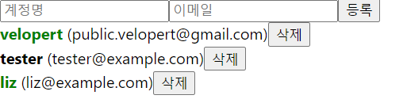
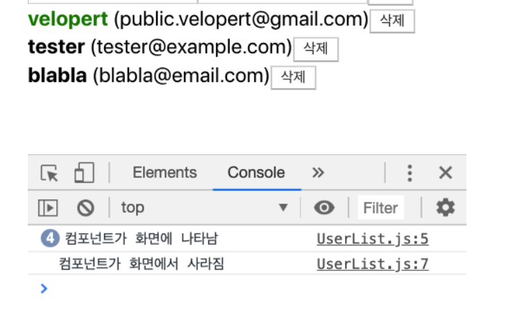
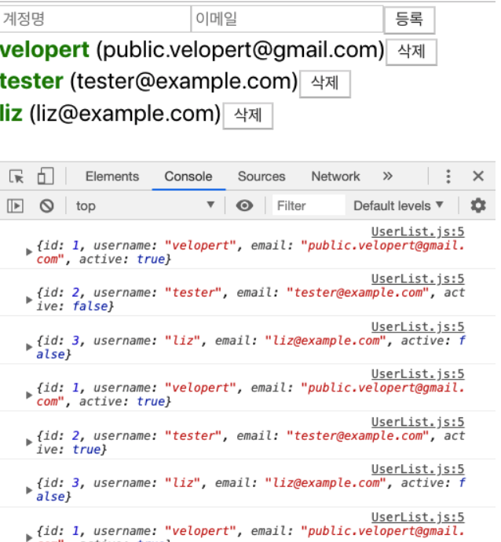
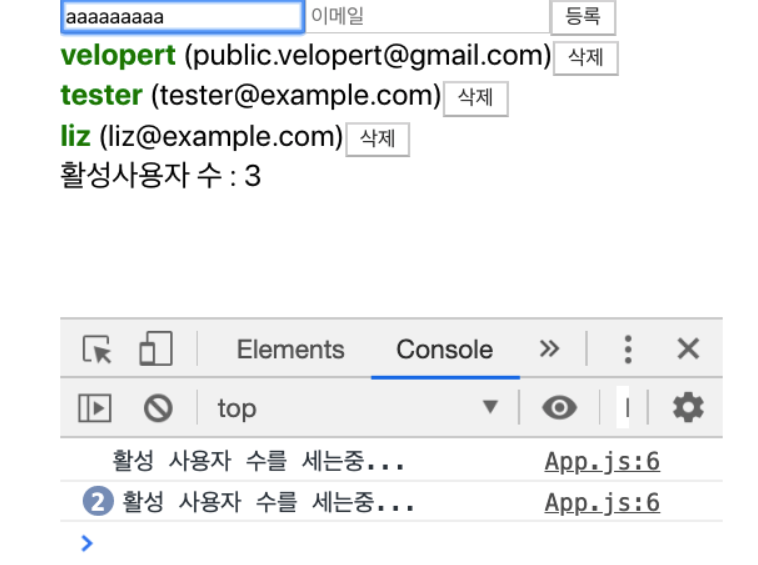

### 11. 배열 렌더링하기

```react
import React from 'react';

function User({ user }) {
  return (
    <div>
      <b>{user.username}</b> <span>({user.email})</span>
    </div>
  );
}

// 한 파일 안에 여러 개의 컴포넌트를 선언해도 괜찮다!!
function UserList() {
  const users = [
    {
      id: 1,
      username: 'velopert',
      email: 'public.velopert@gmail.com'
    },
    {
      id: 2,
      username: 'tester',
      email: 'tester@example.com'
    },
    {
      id: 3,
      username: 'liz',
      email: 'liz@example.com'
    }
  ];

  return (
    <div>
      {users.map(user => (
        // 리액트에서 배열을 렌더링할 때는 key라는 props를 설정해야 한다.
        // key 값은 각 원소들마다 가지고 있는 고유값으로 설정해야 한다!!
        // 지금의 경우는 id가 고유값이지만, id가 없는 경우 아래 설명 참조
        <User user={user} key={user.id} />
      ))}
    </div>
  );
}

export default UserList;
```

- `map`은 배열 안의 각 원소를 변환할 때 사용되며, 이 과정에서 새로운 배열이 만들어진다.


- 👉 id값이 없어 key 값을 설정 못할 때는 콜백 함수의 두번째 파라미터인 index를 key로 설정하면 된다.

```react
<div>
  {users.map((user, index) => (
    <User user={user} key={index} />
  ))}
</div>
```

- key 값을 설정해주지 않으면, 수정되지 않은 기존의 값은 그대로 두고 원하는 곳에 내용을 삽입하거나 삭제가 가능하다. 즉, 비효율적인 수정을 피할 수 있다!!


----


### 12. useRef로 컴포넌트 안의 변수 만들기

- `useRef` HOOK은 DOM을 선택하는 용도 외에도, 컴포넌트 안에서 조회 및 수정할 수 있는 변수를 관리할 수 있게 해준다.
- `useRef`로 관리하는 변수는 값이 바뀐다고 해서 컴포넌트가 리렌더링되지는 않는다.
- 리액트 컴포넌트에서의 상태는 상태를 바꾸는 함수를 호출하고 나서 그 다음 렌더링 이후로 업데이트된 상태ㄹ를 조회할 수 있는 반면, `useRef`로 관리하고 있는 변수는 설정 후 바로 조회할 수 있다.
  - `setTimeout`, `setInterval`을 통해서 만들어진 `id`
  - 외부 라이브러리를 사용하여 생성된 인스턴스
  - scroll 위치

```react
// App.js
import React, { useRef } from 'react';
import UserList from './UserList';

function App() {
  const users = [
    {
      id: 1,
      username: 'velopert',
      email: 'public.velopert@gmail.com'
    },
    {
      id: 2,
      username: 'tester',
      email: 'tester@example.com'
    },
    {
      id: 3,
      username: 'liz',
      email: 'liz@example.com'
    }
  ];

  const nextId = useRef(4);
  const onCreate = () => {
    // 나중에 구현 할 배열에 항목 추가하는 로직
    // ...

    nextId.current += 1;
  };
  return <UserList users={users} />;
}

export default App;
```

```react
// UserList.js
import React from 'react';

function User({ user }) {
  return (
    <div>
      <b>{user.username}</b> <span>({user.email})</span>
    </div>
  );
}

function UserList({ users }) {
  return (
    <div>
      {users.map(user => (
        <User user={user} key={user.id} />
      ))}
    </div>
  );
}

export default UserList;
```

- `useRef`를 사용하는 이유는 리렌더링 없이 변수값의 변화를 이용하기 위함이다!


-----


### 13. 배열에 항목 추가하기

```react
import React from 'react';

function CreateUser({ username, email, onChange, onCreate }) {
  return (
    <div>
      <input
        name="username"
        placeholder="계정명"
        onChange={onChange}
        value={username}
      />
      <input
        name="email"
        placeholder="이메일"
        onChange={onChange}
        value={email}
      />
      <button onClick={onCreate}>등록</button>
    </div>
  );
}

export default CreateUser;
```

```react
import React, { useRef, useState } from 'react';
import UserList from './UserList';
import CreateUser from './CreateUser';

function App() {
  const [inputs, setInputs] = useState({
    username: '',
    email: ''
  });
  const { username, email } = inputs;
  const onChange = e => {
    const { name, value } = e.target;
    setInputs({
      ...inputs,
      [name]: value
    });
  };
  const [users, setUsers] = useState([
    {
      id: 1,
      username: 'velopert',
      email: 'public.velopert@gmail.com'
    },
    {
      id: 2,
      username: 'tester',
      email: 'tester@example.com'
    },
    {
      id: 3,
      username: 'liz',
      email: 'liz@example.com'
    }
  ]);

  const nextId = useRef(4);
  const onCreate = () => {
    const user = {
      id: nextId.current,
      username,
      email
    };
    setUsers([...users, user]);
   	// concat 함수를 사용하여 작성하는 방법도 있다!!
    // concat 함수는 기존의 배열을 수정하지 않고, 새로운 원소가 추가된 새로운 배열을 만들어준다.
   	// setUsers(users.concat(user));
      

    setInputs({
      username: '',
      email: ''
    });
    nextId.current += 1;
  };
  return (
    <>
      <CreateUser
        username={username}
        email={email}
        onChange={onChange}
        onCreate={onCreate}
      />
      <UserList users={users} />
    </>
  );
}

export default App;
```


-----


### 14. 배열에 항목 제거하기

```react
import React from 'react';

function User({ user, onRemove }) {
  return (
    <div>
      <b>{user.username}</b> <span>({user.email})</span>
      <button onClick={() => onRemove(user.id)}>삭제</button>
    </div>
  );
}

function UserList({ users, onRemove }) {
  return (
    <div>
      {users.map(user => (
        <User user={user} key={user.id} onRemove={onRemove}/>
      ))}
    </div>
  );
}

export default UserList;
```

```react
import React, { useRef, useState } from 'react';
import UserList from './UserList';
import CreateUser from './CreateUser';

function App() {
  const [inputs, setInputs] = useState({
    username: '',
    email: ''
  });
  const { username, email } = inputs;
  const onChange = e => {
    const { name, value } = e.target;
    setInputs({
      ...inputs,
      [name]: value
    });
  };
  const [users, setUsers] = useState([
    {
      id: 1,
      username: 'velopert',
      email: 'public.velopert@gmail.com'
    },
    {
      id: 2,
      username: 'tester',
      email: 'tester@example.com'
    },
    {
      id: 3,
      username: 'liz',
      email: 'liz@example.com'
    }
  ]);

  const nextId = useRef(4);
  const onCreate = () => {
    const user = {
      id: nextId.current,
      username,
      email
    };
    setUsers(users.concat(user));

    setInputs({
      username: '',
      email: ''
    });
    nextId.current += 1;
  };

  const onRemove = id => {
    // user.id 가 파라미터로 일치하지 않는 원소만 추출해서 새로운 배열을 만듬
    // = user.id 가 id 인 것을 제거함
    setUsers(users.filter(user => user.id !== id));
  };
  return (
    <>
      <CreateUser
        username={username}
        email={email}
        onChange={onChange}
        onCreate={onCreate}
      />
      <UserList users={users} onRemove={onRemove} />
    </>
  );
}

export default App;
```

- JS에서 filter 함수 : 해석 그대로 걸러주는 역할을 한다. 주로 특정 조건을 만족하는 새로운 배열을 필요로 할 때 사용하는 편.


----


### 15. 배열에 항목 수정하기

```react
import React from 'react';

function User({ user, onRemove, onToggle }) {
  return (
    <div>
      <b
        style={{
          cursor: 'pointer',
          // user의 active가 true면 초록색, false면 검정색이 된다.
          color: user.active ? 'green' : 'black'
        }}
        onClick={() => onToggle(user.id)}
      >
        {user.username}
      </b>
      &nbsp;
      <span>({user.email})</span>
      <button onClick={() => onRemove(user.id)}>삭제</button>
    </div>
  );
}

function UserList({ users, onRemove, onToggle }) {
  return (
    <div>
      {users.map(user => (
        <User
          user={user}
          key={user.id}
          onRemove={onRemove}
          onToggle={onToggle}
        />
      ))}
    </div>
  );
}

export default UserList;
```

```react
import React, { useRef, useState } from 'react';
import UserList from './UserList';
import CreateUser from './CreateUser';

function App() {
  const [inputs, setInputs] = useState({
    username: '',
    email: ''
  });
  const { username, email } = inputs;
  const onChange = e => {
    const { name, value } = e.target;
    setInputs({
      ...inputs,
      [name]: value
    });
  };
  const [users, setUsers] = useState([
    {
      id: 1,
      username: 'velopert',
      email: 'public.velopert@gmail.com',
      active: true
    },
    {
      id: 2,
      username: 'tester',
      email: 'tester@example.com',
      active: false
    },
    {
      id: 3,
      username: 'liz',
      email: 'liz@example.com',
      active: false
    }
  ]);

  const nextId = useRef(4);
  const onCreate = () => {
    const user = {
      id: nextId.current,
      username,
      email
    };
    setUsers(users.concat(user));

    setInputs({
      username: '',
      email: ''
    });
    nextId.current += 1;
  };

  const onRemove = id => {
    // user.id 가 파라미터로 일치하지 않는 원소만 추출해서 새로운 배열을 만듬
    // = user.id 가 id 인 것을 제거함
    setUsers(users.filter(user => user.id !== id));
  };
  const onToggle = id => {
    setUsers(
      users.map(user =>
        user.id === id ? { ...user, active: !user.active } : user
      )
    );
  };
  return (
    <>
      <CreateUser
        username={username}
        email={email}
        onChange={onChange}
        onCreate={onCreate}
      />
      <UserList users={users} onRemove={onRemove} onToggle={onToggle} />
    </>
  );
}

export default App;
```




-----


### 16. useEffect를 사용하여 마운트/언마운트/업데이트시 할 작업 설정하기

```react
import React, { useEffect } from 'react';

function User({ user, onRemove, onToggle }) {
  useEffect(() => {
    console.log('컴포넌트가 화면에 나타남');
    return () => {
      console.log('컴포넌트가 화면에서 사라짐');
    };
  }, []);
    
    
  return (
    <div>
      <b
        style={{
          cursor: 'pointer',
          color: user.active ? 'green' : 'black'
        }}
        onClick={() => onToggle(user.id)}
      >
        {user.username}
      </b>
      &nbsp;
      <span>({user.email})</span>
      <button onClick={() => onRemove(user.id)}>삭제</button>
    </div>
  );
}

function UserList({ users, onRemove, onToggle }) {
  return (
    <div>
      {users.map(user => (
        <User
          user={user}
          key={user.id}
          onRemove={onRemove}
          onToggle={onToggle}
        />
      ))}
    </div>
  );
}

export default UserList;
```

- `useEffect` 함수는 리액트 컴포넌트가 렌더링 될 때마다 특정 작업을 실행할 수 있도록 하는 Hook이다.
- `useEffect`를 사용할 때에는 첫번째 파라미터에는 함수, 두번째 파라미터에는 의존값이 들어있는 배열(deps)을 넣는다. 만약에 `deps` 배열을 비우게 된다면, 컴포넌트가 처음 나타날 때에만 `useEffect`에 등록한 함수가 호출된다.
  - 👉 컴포넌트가 화면에 가장 처음 렌더링 될 때 한 번만 실행하고 싶을 때는 `deps` 위치에 빈 배열을 넣는다.
  - 👉 만약 배열을 생략한다면 리렌더링 될 때마다 실행된다.

- 그리고 `useEffect`에서는 함수를 반환할 수 있는데 이를 `cleanup` 함수라고 부른다. `cleanup`함수는 `useEffect`에 대한 뒷정리를 해준다고 이해하면 된다! `deps`가 비어있는 경우 컴포넌트가 사라질때 `cleanup` 함수가 호출된다.



```react
import React, { useEffect } from 'react';

function User({ user, onRemove, onToggle }) {
  useEffect(() => {
    console.log(user);
  });
  return (
    <div>
      <b
        style={{
          cursor: 'pointer',
          color: user.active ? 'green' : 'black'
        }}
        onClick={() => onToggle(user.id)}
      >
        {user.username}
      </b>
      &nbsp;
      <span>({user.email})</span>
      <button onClick={() => onRemove(user.id)}>삭제</button>
    </div>
  );
}

function UserList({ users, onRemove, onToggle }) {
  return (
    <div>
      {users.map(user => (
        <User
          user={user}
          key={user.id}
          onRemove={onRemove}
          onToggle={onToggle}
        />
      ))}
    </div>
  );
}

export default UserList;
```




----


### 17. userMemo를 사용하여 연산한 값 재사용하기

```mereact
import React, { useRef, useState, useMemo } from 'react';
import UserList from './UserList';
import CreateUser from './CreateUser';

function countActiveUsers(users) {
  console.log('활성 사용자 수를 세는중...');
  return users.filter(user => user.active).length;
}

function App() {
  const [inputs, setInputs] = useState({
    username: '',
    email: ''
  });
  const { username, email } = inputs;
  const onChange = e => {
    const { name, value } = e.target;
    setInputs({
      ...inputs,
      [name]: value
    });
  };
  const [users, setUsers] = useState([
    {
      id: 1,
      username: 'velopert',
      email: 'public.velopert@gmail.com',
      active: true
    },
    {
      id: 2,
      username: 'tester',
      email: 'tester@example.com',
      active: false
    },
    {
      id: 3,
      username: 'liz',
      email: 'liz@example.com',
      active: false
    }
  ]);

  const nextId = useRef(4);
  const onCreate = () => {
    const user = {
      id: nextId.current,
      username,
      email
    };
    setUsers(users.concat(user));

    setInputs({
      username: '',
      email: ''
    });
    nextId.current += 1;
  };

  const onRemove = id => {
    // user.id 가 파라미터로 일치하지 않는 원소만 추출해서 새로운 배열을 만듬
    // = user.id 가 id 인 것을 제거함
    setUsers(users.filter(user => user.id !== id));
  };
  const onToggle = id => {
    setUsers(
      users.map(user =>
        user.id === id ? { ...user, active: !user.active } : user
      )
    );
  };
  const count = useMemo(() => countActiveUsers(users), [users]);
  return (
    <>
      <CreateUser
        username={username}
        email={email}
        onChange={onChange}
        onCreate={onCreate}
      />
      <UserList users={users} onRemove={onRemove} onToggle={onToggle} />
      <div>활성사용자 수 : {count}</div>
    </>
  );
}

export default App;
```

- `useMemo` : 컴포넌트의 성능을 최적화시킬 수 있는 대표적은 react hooks 중 하나. 
  - Memo는 Memoization을 의미. memoization이란 기조에 수행한 연산의 결괏값을 어딘가에 저장해 두고 동일한 입력이 들어오면 재활용하는 프로그래밍 기법을 의미.




----


### 18. useCallback을 사용하여 함수 재사용하기

- `useMemo`는 특정 결과값을 재사용할 때 사용하는 반면, `useCallback`은 특정 함수를 새로 만들지 않고 재사용하고 싶을 때 사용한다.

```react
import React, { useRef, useState, useMemo, useCallback } from 'react';
import UserList from './UserList';
import CreateUser from './CreateUser';

function countActiveUsers(users) {
  console.log('활성 사용자 수를 세는중...');
  return users.filter(user => user.active).length;
}

function App() {
  const [inputs, setInputs] = useState({
    username: '',
    email: ''
  });
  const { username, email } = inputs;
  const onChange = useCallback(
    e => {
      const { name, value } = e.target;
      setInputs({
        ...inputs,
        [name]: value
      });
    },
    [inputs]
  );
  const [users, setUsers] = useState([
    {
      id: 1,
      username: 'velopert',
      email: 'public.velopert@gmail.com',
      active: true
    },
    {
      id: 2,
      username: 'tester',
      email: 'tester@example.com',
      active: false
    },
    {
      id: 3,
      username: 'liz',
      email: 'liz@example.com',
      active: false
    }
  ]);

  const nextId = useRef(4);
  const onCreate = useCallback(() => {
    const user = {
      id: nextId.current,
      username,
      email
    };
    setUsers(users.concat(user));

    setInputs({
      username: '',
      email: ''
    });
    nextId.current += 1;
  }, [users, username, email]);

  const onRemove = useCallback(
    id => {
      // user.id 가 파라미터로 일치하지 않는 원소만 추출해서 새로운 배열을 만듬
      // = user.id 가 id 인 것을 제거함
      setUsers(users.filter(user => user.id !== id));
    },
    [users]
  );
  const onToggle = useCallback(
    id => {
      setUsers(
        users.map(user =>
          user.id === id ? { ...user, active: !user.active } : user
        )
      );
    },
    [users]
  );
  const count = useMemo(() => countActiveUsers(users), [users]);
  return (
    <>
      <CreateUser
        username={username}
        email={email}
        onChange={onChange}
        onCreate={onCreate}
      />
      <UserList users={users} onRemove={onRemove} onToggle={onToggle} />
      <div>활성사용자 수 : {count}</div>
    </>
  );
}

export default App;
```

- 주의할 점!!! 함수 안에서 사용하는 상태 혹은 props가 있다면 꼭, `deps` 배열안에 포함시켜야 된다는 것.
- 만약에 `deps` 배열 안에 함수에서 사용하는 값을 넣지 않게 된다면, 함수 내에서 해당 값들을 참조할 때 가장 최신 값을 참조할 것이라고 보장할 수 없다. props로 받아온 함수가 있다면, 이 또한 `deps` 안에 넣어주어야 한다.
- 사실 `useCallback`은 `useMemo`를 기반으로 만들어졌다. 다만, 함수를 위해서 사용할 때 더욱 편하게 해준 것이다.


----


### 19. React.memo를 사용한 컴포넌트 리렌더링 방지

- `React.memo` 함수 = 컴포넌트의 props가 바뀌지 않았다면, 리렌더링을 방지하여 컴포넌트의 리렌더링 성능 최적화를 해줄 수 있게 해주는 함수!
- 적용 방법은 굉장히 쉽다! 마지막에 export에서 `React.memo`로 감싸주면 끝

```react
export default React.memo(CreateUser);

export default React.memo(UserList);
```

- 하지만,  위의 예시 코드로 보면 App.js 내부에 작성된 함수들 중 `useCallback`이 적용된 함수에 deps 파트로 users가 들어있어 users 배열이 바뀔 때마다 함수가 새로 만들어져 리렌더링이 된다. 이걸 최적화하고 싶다면?? 👉 deps에 있는 users를 지우고, 함수들에서 현재 `useState`로 관리하는 users를 참조하지 않게 하는 것.
- 그것은 바로 `함수형 업데이트` !!! 함수형 업데이트를 하게 되면, setUsers에 등록하는 콜백함수의 파라미터에서 최신 users를 참조할 수 있기 때문에 deps에 users를 넣지 않아도 된다.

```react
import React, { useRef, useState, useMemo, useCallback } from 'react';
import UserList from './UserList';
import CreateUser from './CreateUser';

function countActiveUsers(users) {
  console.log('활성 사용자 수를 세는중...');
  return users.filter(user => user.active).length;
}

function App() {
  const [inputs, setInputs] = useState({
    username: '',
    email: ''
  });
  const { username, email } = inputs;
  const onChange = useCallback(e => {
    const { name, value } = e.target;
    setInputs(inputs => ({
      ...inputs,
      [name]: value
    }));
  }, []);
  const [users, setUsers] = useState([
    {
      id: 1,
      username: 'velopert',
      email: 'public.velopert@gmail.com',
      active: true
    },
    {
      id: 2,
      username: 'tester',
      email: 'tester@example.com',
      active: false
    },
    {
      id: 3,
      username: 'liz',
      email: 'liz@example.com',
      active: false
    }
  ]);

  const nextId = useRef(4);
  const onCreate = useCallback(() => {
    const user = {
      id: nextId.current,
      username,
      email
    };
    // 여기를 주목하라
    setUsers(users => users.concat(user));

    setInputs({
      username: '',
      email: ''
    });
    nextId.current += 1;
  }, [username, email]);

  const onRemove = useCallback(id => {
    // user.id 가 파라미터로 일치하지 않는 원소만 추출해서 새로운 배열을 만듬
    // = user.id 가 id 인 것을 제거함
      
    // 여기를 주목하라
    setUsers(users => users.filter(user => user.id !== id));
  }, []);
  // 여기를 주목하라
  const onToggle = useCallback(id => {
    setUsers(users =>
      users.map(user =>
        user.id === id ? { ...user, active: !user.active } : user
      )
    );
  }, []);
  const count = useMemo(() => countActiveUsers(users), [users]);
  return (
    <>
      <CreateUser
        username={username}
        email={email}
        onChange={onChange}
        onCreate={onCreate}
      />
      <UserList users={users} onRemove={onRemove} onToggle={onToggle} />
      <div>활성사용자 수 : {count}</div>
    </>
  );
}

export default App;
```


-----


### 20. useReducer를 사용하여 상태 업데이트 로직 분리하기

- 상태를 업데이트할 때에는 `useState`를 사용하는 것 외에도 `useReducer`을 사용하는 방법이 있다! 이 둘을 사용하는 환경에서 어떤 것을 써야한다, 라는 정답은 없지만 상황에 따라 더 편리하게 느껴지는 것이 있다.
- 예를 들어 컴포넌트에서 관리하는 값이 딱 하나고, 그 값이 단순한 숫자, 문자열 또는 boolean 값이라면 확실히 `useState`로 관리하는 것이 편할 것이다.
- 하지만, 만약에 컴포넌트에서 관리하는 값이 여러 개가 되어서 상태의 구조가 복잡해진다면 `useReducer`로 관리하는 것이 편해질 수도 있다.

```react
import React, { useRef, useReducer, useMemo, useCallback } from 'react';
import UserList from './UserList';
import CreateUser from './CreateUser';

function countActiveUsers(users) {
  console.log('활성 사용자 수를 세는중...');
  return users.filter(user => user.active).length;
}

const initialState = {
  inputs: {
    username: '',
    email: ''
  },
  users: [
    {
      id: 1,
      username: 'velopert',
      email: 'public.velopert@gmail.com',
      active: true
    },
    {
      id: 2,
      username: 'tester',
      email: 'tester@example.com',
      active: false
    },
    {
      id: 3,
      username: 'liz',
      email: 'liz@example.com',
      active: false
    }
  ]
};

function reducer(state, action) {
  switch (action.type) {
    case 'CHANGE_INPUT':
      return {
        ...state,
        inputs: {
          ...state.inputs,
          [action.name]: action.value
        }
      };
    case 'CREATE_USER':
      return {
        inputs: initialState.inputs,
        users: state.users.concat(action.user)
      };
    case 'TOGGLE_USER':
      return {
        ...state,
        users: state.users.map(user =>
          user.id === action.id ? { ...user, active: !user.active } : user
        )
      };
    case 'REMOVE_USER':
      return {
        ...state,
        users: state.users.filter(user => user.id !== action.id)
      };
    default:
      return state;
  }
}

function App() {
  const [state, dispatch] = useReducer(reducer, initialState);
  const nextId = useRef(4);

  const { users } = state;
  const { username, email } = state.inputs;

  const onChange = useCallback(e => {
    const { name, value } = e.target;
    dispatch({
      type: 'CHANGE_INPUT',
      name,
      value
    });
  }, []);

  const onCreate = useCallback(() => {
    dispatch({
      type: 'CREATE_USER',
      user: {
        id: nextId.current,
        username,
        email
      }
    });
    nextId.current += 1;
  }, [username, email]);

  const onToggle = useCallback(id => {
    dispatch({
      type: 'TOGGLE_USER',
      id
    });
  }, []);

  const onRemove = useCallback(id => {
    dispatch({
      type: 'REMOVE_USER',
      id
    });
  }, []);

  const count = useMemo(() => countActiveUsers(users), [users]);
  return (
    <>
      <CreateUser
        username={username}
        email={email}
        onChange={onChange}
        onCreate={onCreate}
      />
      <UserList users={users} onToggle={onToggle} onRemove={onRemove} />
      <div>활성사용자 수 : {count}</div>
    </>
  );
}

export default App;
```

