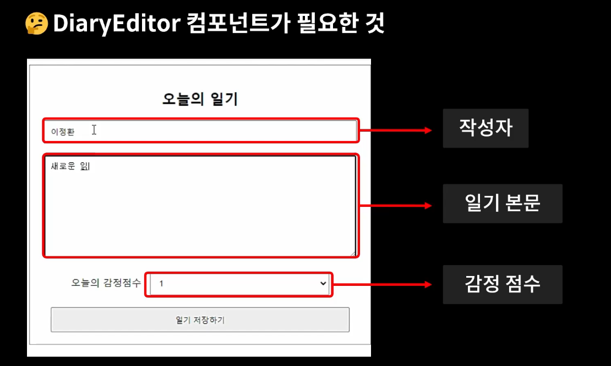
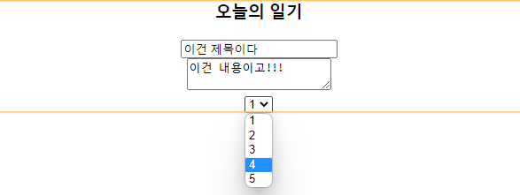
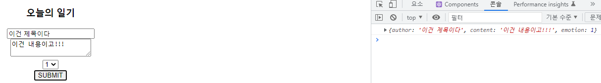

> DiaryEditor 만들기

```js
const DiaryEditor = () => {
  return (
    <div className = "DiaryEditor">

    </div>
  )
}

export default DiaryEditor;
```

- 새로운 JS 컴포넌트를 만들고 나면 가장 최상단 < div > 태그의 `className`은 컴포넌트의 이름과 같이 하면 좋다! 
- 절대적인 것은 아니고, 나중에 css 작업할 때 편리하기 위함



위에서부터 하나하나 차근히 만들어보도록 하겠다!


```js
import { useState } from 'react'

const DiaryEditor = () => {
  const [author, setAuthor ] = useState('')
  return (
    <div className = "DiaryEditor">
      <h3>오늘의 일기</h3>
      <div>
        <input value={author}
          onChange={(e)=> {console.log(e)}}
        ></input>
      </div>
    </div>
  )
}

export default DiaryEditor;
```

- `onChange` = 사용자로부터 어떤 입력값을 받는 콜백함수. 어떤 값이 바뀌면 이벤트가 발생한 것으로 이해한다.
- `set~` 으로 시작하는 것은 상태를 변화시키기 위한 것이다.

```js
import { useState } from 'react'

const DiaryEditor = () => {
  const [ author, setAuthor ] = useState('')
  const [ content, setContent ] = useState('')
  return (
    <div className = "DiaryEditor">
      <h3>오늘의 일기</h3>
      <div>
        <input value={author}
          onChange={(e)=> {setAuthor(e.target.value)}}
        ></input>
      </div>
      <div>
        <textarea value={content}
          onChange={(e)=> {setContent(e.target.value)}}
        >
        </textarea>
      </div>
    </div>
  )
}

export default DiaryEditor;
```


- 위의 제목과 아래의 일기장 내용은 동일한 구성으로 간다.
- `onChange` 함수를 통해 상태값을 변화시키고 이 변화된 useState의 내용이 다시 화면에서 반영되는 구조 


```js
import { useState } from 'react'

const DiaryEditor = () => {
	// 하나하나 다 따로 작성하지 않고 state로 한 번에 묶어서 관리해주기
    const [ state, setState ] = useState({
    author : '',
    content: ''
  })

  // const [ author, setAuthor ] = useState('')
  // const [ content, setContent ] = useState('')
    
  return (
    <div className = "DiaryEditor">
      <h3>오늘의 일기</h3>
      <div>
        <input 
          name = "author"
          value={ state.author}
          onChange={(e)=> { setState({
            // state에 저장된 값이 많지 않으면 이렇게 저장 가능
            // 대신 state에 저장할 변수들이 많으면
            // ...state, 같이 spread 연산자를 통해 코드를 축약할 수 있다.
            // ex) ...state, author : e.target.value
            // 대신, spread 연산자를 위와 같이 먼저 작성해주고 변경하고자할 내용을 이후에 작성!!!!
            // spread 연산자를 이후에 작성하면 변경한 내용이 그대로 덮여져버린다.
            author : e.target.value,
            content : state.content
          })}}
        ></input>
      </div>
      <div>
        <textarea
          name = 'content' 
          value = { state.content}
          onChange={(e)=> { setState({
            author : state.author,
            content : e.target.value
          })}}
        >
        </textarea>
      </div>
    </div>
  )
}

export default DiaryEditor;
```

```js
import { useState } from 'react'

const DiaryEditor = () => {
  const [ state, setState ] = useState({
    author : '',
    content: ''
  })

  // 변경할 값 하나하나 onChange 함수에 작성하지 않고 위에서 한 번에 관리 가능!
  // 
  const handleChangeState = (e) => {
    setState({
      ...state,
      [e.target.name] : e.target.value
    })
  }

  return (
    <div className = "DiaryEditor">
      <h3>오늘의 일기</h3>
      <div>
        <input 
          name = "author"
          value={ state.author}
          onChange={handleChangeState}
        ></input>
      </div>
      <div>
        <textarea
          name = 'content' 
          value = { state.content}
          onChange={handleChangeState}
        >
        </textarea>
      </div>
    </div>
  )
}

export default DiaryEditor;
```


----




```js
import { useState } from 'react'

const DiaryEditor = () => {
  const [ state, setState ] = useState({
    author : '',
    content: '',
    emotion : 1,
  })

  const handleChangeState = (e) => {
    setState({
      ...state,
      [e.target.name] : e.target.value
    })
  }

  return (
    <div className = "DiaryEditor">
      <h3>오늘의 일기</h3>
      <div>
        <input 
          name = "author"
          value={ state.author}
          onChange={handleChangeState}
        ></input>
      </div>
      <div>
        <textarea
          name = 'content' 
          value = { state.content}
          onChange={handleChangeState}
        >
        </textarea>
      </div>
      <div>
        <select name='emotion'
          value={state.emotion}
          onChange={handleChangeState}>
          <option value={1}>1</option>
          <option value={2}>2</option>
          <option value={3}>3</option>
          <option value={4}>4</option>
          <option value={5}>5</option>
        </select>
      </div>
    </div>
  )
}

export default DiaryEditor;
```

- 감정 지수를 선택하는 저 숫자칸은 `select` 태그를 이용해 표현 가능하다.
- 점수 선택 역시 위의 제목, 일기 내용 입력하는 것과 같아서 state에 입력 후 `onChange` 함수를 통해 변경 가능하다.


----




```js
import { useState } from 'react'

const DiaryEditor = () => {
  const [ state, setState ] = useState({
    author : '',
    content: '',
    emotion : 1,
  })

  const handleChangeState = (e) => {
    setState({
      ...state,
      [e.target.name] : e.target.value
    })
  }

  const handleSubmit = () => {
    console.log(state)
    alert('저장 성공!')
  }

  return (
    <div className = "DiaryEditor">
      <h3>오늘의 일기</h3>
      <div>
        <input 
          name = "author"
          value={ state.author}
          onChange={handleChangeState}
        ></input>
      </div>
      <div>
        <textarea
          name = 'content' 
          value = { state.content}
          onChange={handleChangeState}
        >
        </textarea>
      </div>
      <div>
        <select name='emotion'
          value={state.emotion}
          onChange={handleChangeState}>
          <option value={1}>1</option>
          <option value={2}>2</option>
          <option value={3}>3</option>
          <option value={4}>4</option>
          <option value={5}>5</option>
        </select>
      </div>
      <div>
        <button onClick={ handleSubmit}>SUBMIT</button>
      </div>
    </div>
  )
}

export default DiaryEditor;
```

