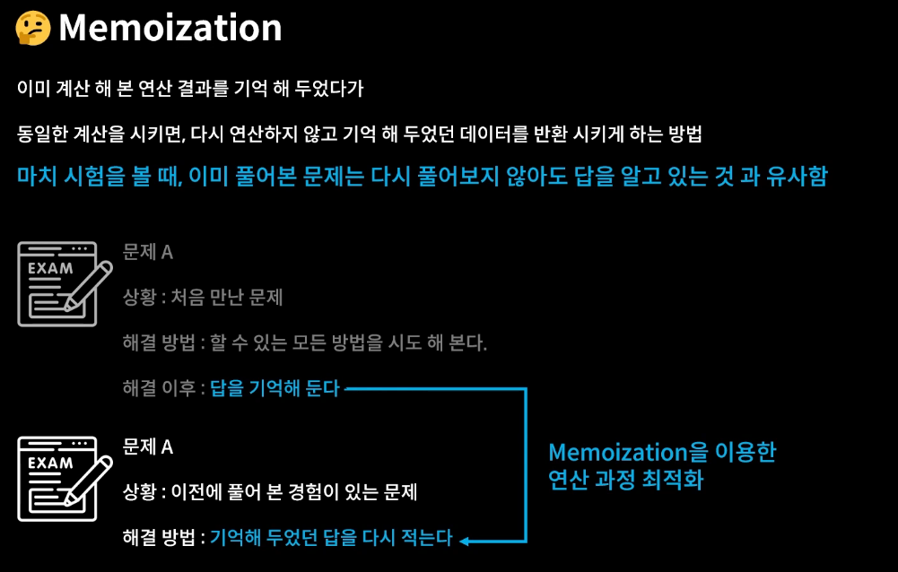

```js
// App.js

import './App.css';
import DiaryEditor from './DiaryEditor.js'
import DiaryList from './DiaryList.js'
import { useRef, useState, useMemo } from 'react'

function App() {
  const [data, setData] = useState([])

  const dataId = useRef(0)

  const onCreate = (author,content,emotion) => {
    const created_date = new Date().getTime();
    const newItem = {
      author,
      content,
      emotion,
      created_date,
      id : dataId.current
    }
    dataId.current += 1
    setData([newItem, ...data])
  }

  const onRemove = (targetId) => {
    console.log(`${targetId}가 삭제되었습니다`)
    const newDiaryList = data.filter((it)=> it.id !== targetId)
    setData(newDiaryList)
  }

  const onEdit = (targetId, newContent) => {
    setData(
      data.map((it)=> it.id=== targetId ? {...it, content:newContent} : it)
    )
  }

  
  // useMemo는 첫 번째 인자로 콜백 함수를 받는다.
  // 콜백 함수로 기능을 전달해주고, return 값을 최적화하도록 도와준다.
  const getDiaryAnalysis = useMemo((
    ) => {
    console.log('일기 분석 시작')

    const goodCount = data.filter((it)=> it.emotion >= 3).length;
    const badCount = data.length - goodCount;
    const goodRatio = (goodCount/data.length) * 100

    return {goodCount, badCount, goodRatio}
      
  // 두 번째 인자로 배열을 받는다.
  // 이 배열이 변화하지 않는 이상 위의 return 값을 똑같이 계속 반환해준다.
  }, [data.length]
  )

  // useMemo를 쓴 순간부터 더 이상 위의 getDiaryAnalysis는 함수가 아니라 값이 된다.
  // 그렇기 때문에 사용할 때는 함수 ()가 아닌 이름으로 작성해주어야 한다.
  const {goodCount, badCount, goodRatio} = getDiaryAnalysis

  return (
    <div className="App">
      <DiaryEditor onCreate={onCreate}></DiaryEditor>
      <div>전체 일기 : {data.length}</div>
      <div>기분 좋은 일기 개수 : {goodCount}</div>
      <div>기분 나쁜 일기 개수 : {badCount}</div>
      <div>기분 좋은 일기 비율 : {goodRatio}</div>
      <DiaryList diaryList={data}
        onRemove={onRemove}
        onEdit={onEdit}
      ></DiaryList>
    </div>
  );
}

export default App;
```

- 위의 useMemo를 사용하면!!!!
- deps 배열 안에 작성해준 data.length가 바뀌지 않는 `수정하기` 버튼을 클릭했을 경우 리렌더링이 되지 않는다.
- `삭제하기` , `일기 등록하기`를 하는 경우에만 리렌더링되도록 하였다!!!


