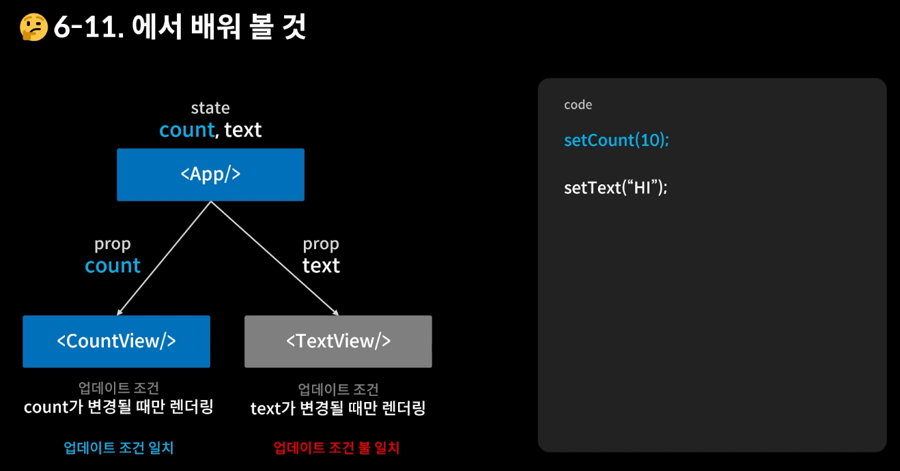
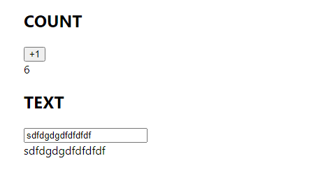
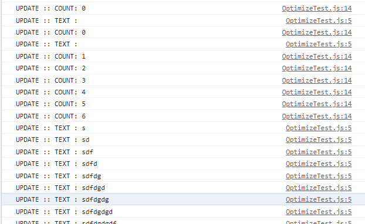
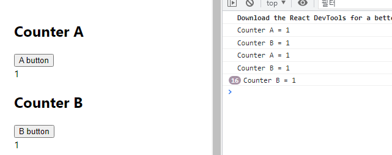
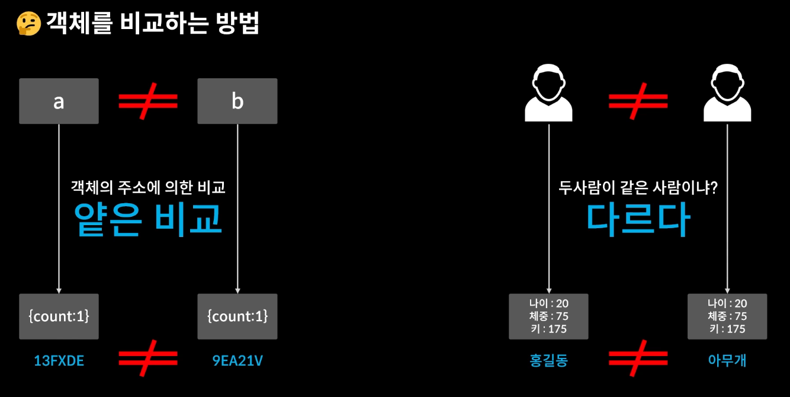
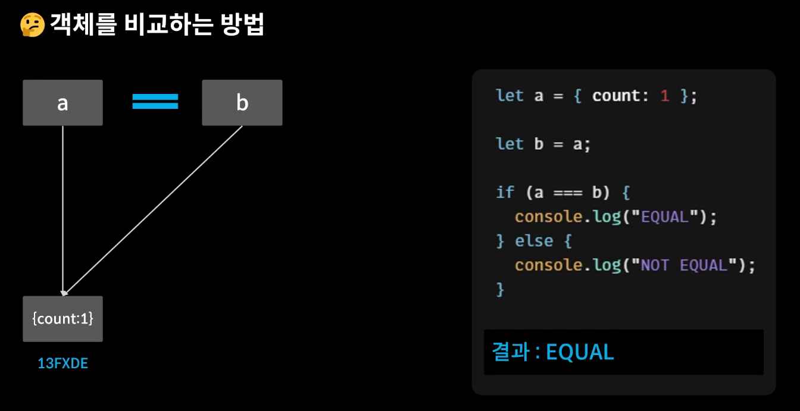

```js
const MyComponent = React.memo(function MyComponent(props) {
  /* props를 사용하여 렌더링 */
});
```

- 동일한 props를 주면 똑같은 것임을 알고 리렌더링하지 않겠다! 라는 뜻이다.
- 리렌더링되지 않았으면 하는 컴포넌트를 `React.memo`라는 고차 컴포넌트로 감싸주게 되면, props가 바뀌지 않으면 리렌더링하지 않는 강화된 컴포넌트로 돌려주겠다!


----




```js
// OptimizeTest.js

import React, {useState, useEffect} from 'react'

const TextView = React.memo(({text}) => {
  useEffect(()=> {
    console.log(`UPDATE :: TEXT : ${text}`);
  })
  return (
    <div>{text}</div>
  )
})

const CountView = React.memo(({count}) => {
  useEffect(()=> {
    console.log(`UPDATE :: COUNT: ${count}`);
  })
  return (
    <div>{count}</div>
  )
})

const OptimizeTest = () => {
  const [count, setCount] = useState(0)
  const [text, setText] = useState('')

  return (
    <div style={{padding : 50}}>
      <div>
        <h2>COUNT</h2>
        <button onClick={()=> {setCount(count+1)}}>+1</button>
        <CountView count={count}></CountView>
      </div> 
      <div>
        <h2>TEXT</h2>
        <input onChange={(e)=> setText(e.target.value)} value={text}></input>
        <TextView text={text}></TextView>
      </div>
    </div>
  )
}

export default OptimizeTest
```


-----



```js
import React, {useState, useEffect} from 'react'

const CounterA = React.memo(({count}) => {
  useEffect(()=> {
    console.log(`Counter A = ${count}`)
  })
  return (
    <div>{count}</div>
  )
})

const CounterB = React.memo(({obj}) => {
  useEffect(()=> {
    console.log(`Counter B = ${obj.count}`)
  })
  return (
    <div>{obj.count}</div>
  )
})

const OptimizeTest = () => {
  const [count, setCount] = useState(1)
  // const [text, setText] = useState('')
  const [obj, setObj] = useState({
    count : 1
  })

  return (
    <div style={{padding : 50}}>
      <div>
        <h2>Counter A</h2>
        <button onClick={()=> setCount(count)}>A button</button>
        <CounterA count={count}></CounterA>
      </div>
      <div>
        <h2>Counter B</h2>
        <button onClick={() => setObj({
          count: obj.count
        })}>B button</button>
        <CounterB obj={obj}></CounterB>
      </div>
    </div>
  )
}

export default OptimizeTest;
```

- A는 리렌더링 안되고 B는 되는 이유? B는 객체라서!!!
- 자스에서 객체는 얕은 비교를 하게 된다






```js
import React, {useState, useEffect} from 'react'

// CounterA는 위와 같다
const CounterA = React.memo(({count}) => {
  useEffect(()=> {
    console.log(`Counter A = ${count}`)
  })
  return (
    <div>{count}</div>
  )
})

// CounterB는 useMemo를 해체하고 난 후 새로운 함수와 함께 사용한다.
const CounterB = ({obj}) => {
  useEffect(()=> {
    console.log(`Counter B = ${obj.count}`)
  })
  return (
    <div>{obj.count}</div>
  )
}

// 같은지 판별하는 함수
const areEqual = (prevProps, nextProps) => {
  // return true // 이전 프롭스와 현재 프롭스가 같다 = 리렌더링 일으키지 x
  // return false // 이전과 현재가 다르다 = 리렌더링 가자!

  if(prevProps.obj.count === nextProps.obj.count) {
    return true
  }
  return false
}

const MemoizedCounterB = React.memo(CounterB,areEqual)

const OptimizeTest = () => {
  const [count, setCount] = useState(1)
  // const [text, setText] = useState('')
  const [obj, setObj] = useState({
    count : 1
  })

  return (
    <div style={{padding : 50}}>
      <div>
        <h2>Counter A</h2>
        <button onClick={()=> setCount(count)}>A button</button>
        <CounterA count={count}></CounterA>
      </div>
      <div>
        <h2>Counter B</h2>
        <button onClick={() => setObj({
          count: obj.count
        })}>B button</button>
        <MemoizedCounterB obj={obj}></MemoizedCounterB>
      </div>
    </div>
  )
}

export default OptimizeTest
```


> useMemo와 react memo 비교

- 공통점
  - 모두 props가 변하지 않으면(이전 props와 동일하면) 인자로 넘긴 함수는 실행되지 않고, 이전의 메모이즈된 결과를 반환하는 점이 같다.
- 차이점
  - React.memo는 HOC, useMemo는 hook이다.
  - React.memo는 HOC이기 때문에 클래스형 컴포넌트, 함수형 컴포넌트 모두 사용 가능하지만, useMemo는 hook이기 때문에 오직 함수형 컴포넌트 안에서만 사용 가능하다.