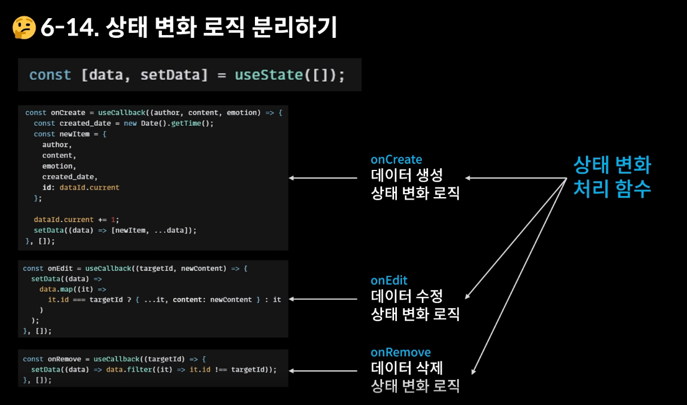

- 점점 길어지는 코드와 읽기 힘든 가독성, 무겁게 사용되는 컴포넌트....
- 이를 `useReducer`를 활용해 가볍게 관리가 가능하다!!!!


```js
const Counter = () => {
    const [count, dispatch] = useReducer(reducer,1)
    return ()
}
```

- 여기서 `비구조화 할당`을 통해 count와 dispatch의 속성을 부여하였다.
- count는 여기서 State가 되고 dispatch는 상태를 변화시키는 액션을 발생시키는 함수가 된다.
- `useReducer` 함수를 작성할때 첫 번째 인자는 꼭 reducer를 작성해주면 된다.
- 두 번째로 전달되는 인자는 count State의 초기값이 된다.
- dispatch와 함께 전달되는 객체(ex. {type: 1})를 `action 객체`라고 부른다.
  - action 은 곧, 상태 변화를 의미한다.
- dispatch가 호출되면 상태 변화가 일어나고, 그 처리는 reducer가 처리한다.


----


```js
// App.js

import './App.css';
import DiaryEditor from './DiaryEditor.js'
import DiaryList from './DiaryList.js'
import { useRef, useMemo, useCallback, useReducer } from 'react'

// 우리가 직접 reducer 라는 함수를 만들어서 사용해야 한다.
// 두 가지 인자를 전달받는데, 첫번째는 상태 변화가 일어나기 직전의 state이고
// 두 번째는 어떤 상태 변화를 일으켜야하는지 정보를 알려주는 action 객체이다.
const reducer = (state, action) => {
  // action의 type 객체의 switch로 상태를 다 구분한다.
  switch(action.type) {
    case 'INIT': {
      return action.data
    }
    case 'CREATE': {
      const created_date = new Date().getTime();
      const newItem = {
        ...action.data,
        created_date
      }
      return [newItem, ...state]
    }
    case 'REMOVE' : {
      return state.filter((it)=> it.id !== action.targetId)
    }
    case 'EDIT' : {
      return state.map((it)=> it.id === action.targetId ?
       {...it, content: action.newContent} : it)
    }
    default: 
      return state;
  }
}

function App() {
  // 이제 더 이상 useState를 사용하지 않아도 된다!!
  // 복잡한 로직을 컴포넌트 밖에서 다루기 위함이다.
  // const [data, setData] = useState([])

  // 첫번째 인자는 위의 reducer 함수, 두 번째 인자는 초기값이므로 여기서는 빈 배열을 넣는다. 
  const [data, dispatch] = useReducer(reducer, [])

  const dataId = useRef(0)

  const onCreate = useCallback(
    (author,content,emotion) => {
      dispatch({type:'CREATE',data:{author, content,emotion,id:dataId.current}})
      // const created_date = new Date().getTime();
      // const newItem = {
      //   author,
      //   content,
      //   emotion,
      //   created_date,
      //   id : dataId.current
      // }
    dataId.current += 1
    // setData((data)=> [newItem, ...data])
  },
  [data])

  const onRemove = useCallback((targetId) => {
    dispatch({type:'REMOVE', targetId})
    // setData(data => data.filter((it)=> it.id !== targetId))
  },[])

  const onEdit = useCallback((targetId, newContent) => {
    dispatch({type:'EDIT', targetId, newContent})
    // setData((data)=>
    //   data.map((it)=> it.id=== targetId ? {...it, content:newContent} : it)
    // )
  },[])

  const getDiaryAnalysis = useMemo((
    ) => {
    const goodCount = data.filter((it)=> it.emotion >= 3).length;
    const badCount = data.length - goodCount;
    const goodRatio = (goodCount/data.length) * 100

    return {goodCount, badCount, goodRatio}
  }, [data.length]
  )

  const {goodCount, badCount, goodRatio} = getDiaryAnalysis

  return (
    <div className="App">
      <DiaryEditor onCreate={onCreate}></DiaryEditor>
      <div>전체 일기 : {data.length}</div>
      <div>기분 좋은 일기 개수 : {goodCount}</div>
      <div>기분 나쁜 일기 개수 : {badCount}</div>
      <div>기분 좋은 일기 비율 : {goodRatio}</div>
      <DiaryList diaryList={data}
        onRemove={onRemove}
        onEdit={onEdit}
      ></DiaryList>
    </div>
  );
}

export default App;
```


