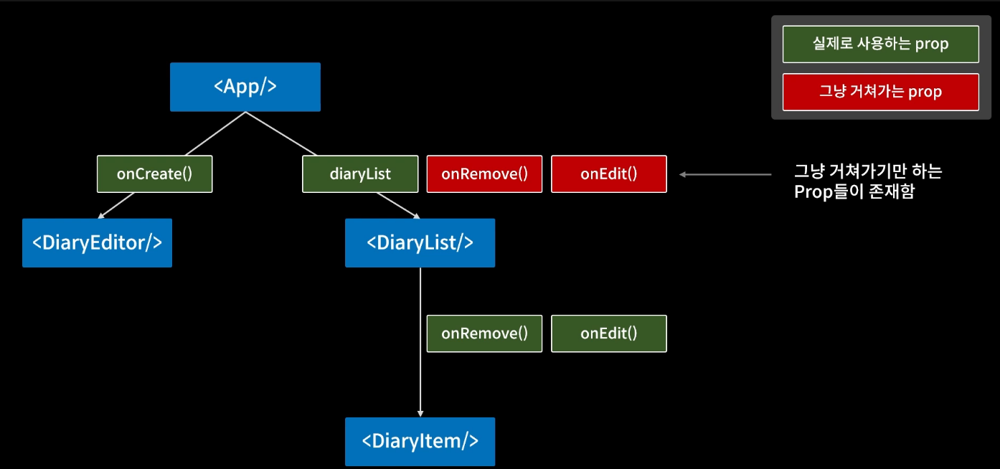
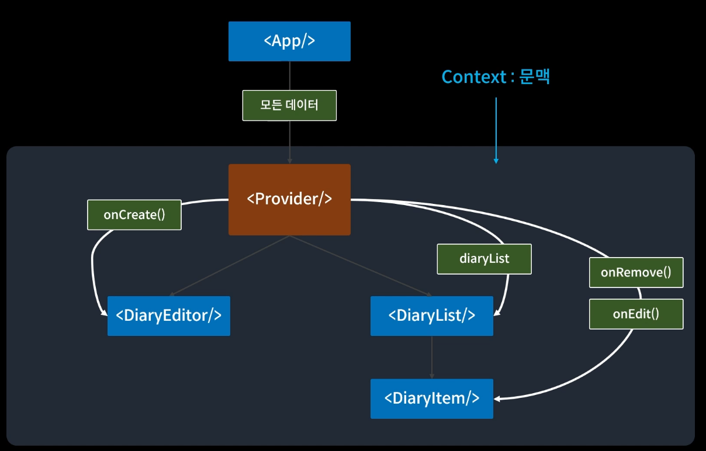
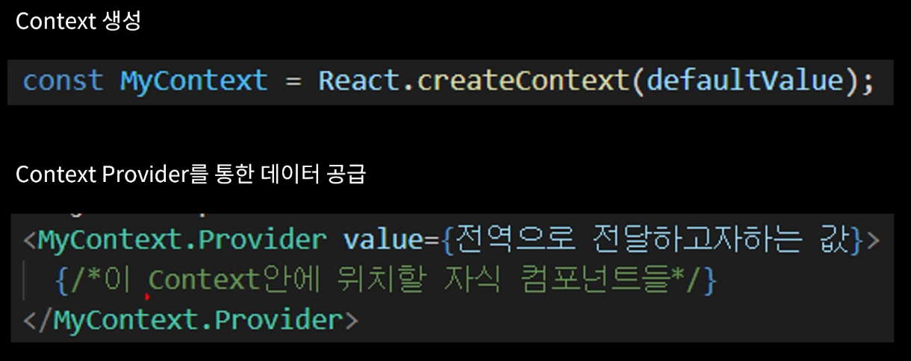

- 이보다는...




- 이와 같은 영역으로 관리하면 더 편리하게 관리가 가능하다.




----


```js
// App.js

// 한 js 파일에서 export를 여러 번 사용하는건 되지만,
// export default는 하나밖에 사용 못한다!!
export const DiaryStateContext = React.createContext();

  return (
    // return 전체를 감싸주고, value 값을 넣어주면 된다. 
    // 그래서 DiaryList에 props로 내려주던 DiaryList는 props 안해줘도 되고
    // DiaryList.js에서 context로 받아주면 된다.
    <DiaryStateContext.Provider value={data}>
      <div className="App">
        <DiaryEditor onCreate={onCreate}></DiaryEditor>
        <div>전체 일기 : {data.length}</div>
        <div>기분 좋은 일기 개수 : {goodCount}</div>
        <div>기분 나쁜 일기 개수 : {badCount}</div>
        <div>기분 좋은 일기 비율 : {goodRatio}</div>
        <DiaryList
          onRemove={onRemove}
          onEdit={onEdit}
        ></DiaryList>
      </div>
    </DiaryStateContext.Provider>
  );
```

```js
// DiaryList.js

const diaryList = useContext(DiaryStateContext)
```

- 위와 같이 `context`를 사용해서 diaryList를 내려주었다.
- 하지만 이렇게 하면 DiaryList 컴포넌트 안에 props로 내려주는 onRemove 함수와 onEdit 함수도 같이 context로 내려주면 될 것 같은데?!?~? 근데 안된다.
- Provider도 결국은 컴포넌트이기 때문에, prop이 바뀌면 결국 재생성된다.
- 말인 즉슨 Provider가 재생성되면 밑에 있는 모든 것들 다 같이 리렌더링돼서 여태껏 만든 최적화가 다 풀리고 만다.
- 그래서 함수를 내려주려면 중첩해서 사용하면 된다. DiaryStateContext는 data만을 위한 context로, dispatch 함수만을 위한 context를 새로 생성해주면 된다.


```js
// App.js

export const DiaryStateContext = React.createContext();

// 아래와 같이 dispatch 함수 전용 context를 만들어준다.
export const DiaryDispatchContext = React.createContext();

// useMemo로 남싸주어야 한다. 재생성되는 일이 없게 deps를 빈 배열로 설정
// useMemo를 활용하지 않고 그냥 return 해버리면 App 컴포넌트가 재생성될때 얘네들 다 재생성된다.
const memoizedDispatches = useMemo(()=> {
    return {onCreate, onRemove, onEdit}
},[])

  return (
    // 그리고 전체 return을 다시 한번 감싸주고 value 값을 넘겨준다
    <DiaryStateContext.Provider value={data}>
      <DiaryDispatchContext.Provider value={memoizedDispatches}>
        <div className="App">
          <DiaryEditor onCreate={onCreate}></DiaryEditor>
          <div>전체 일기 : {data.length}</div>
          <div>기분 좋은 일기 개수 : {goodCount}</div>
          <div>기분 나쁜 일기 개수 : {badCount}</div>
          <div>기분 좋은 일기 비율 : {goodRatio}</div>
          <DiaryList
            onRemove={onRemove}
            onEdit={onEdit}
          ></DiaryList>
        </div>
      </DiaryDispatchContext.Provider>
    </DiaryStateContext.Provider>
  );
```

```js
// DiaryEditor.js

const DiaryEditor = () => {
  // 비구조화 할당으로 넘겨주어야 한다.
  // dispatch로 넘어간 함수는 3개인데 이 페이지에선 1개만 받으므로!
  // ({onCreate}) => {} 형태를 위와 같이 비울 수 있게 되었다.
  const {onCreate} = useContext(DiaryDispatchContext)
  }
```

```js
// DiaryList.js

const DiaryList = () => {
  // 마찬가지로 비구조화 할당으로 나머지 2개의 함수를 받아준다.
  const { onRemove, onEdit } = useContext(DiaryDispatchContext)
  const diaryList = useContext(DiaryStateContext)
  }
```


