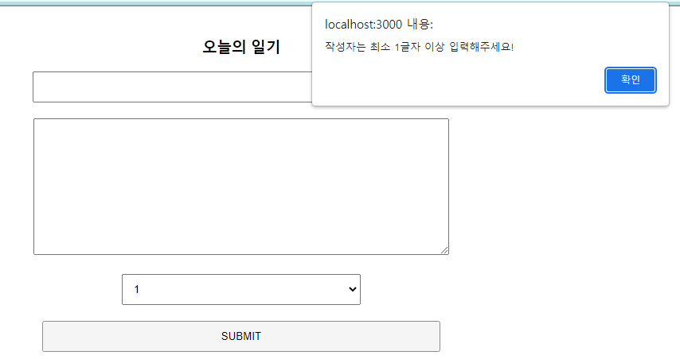
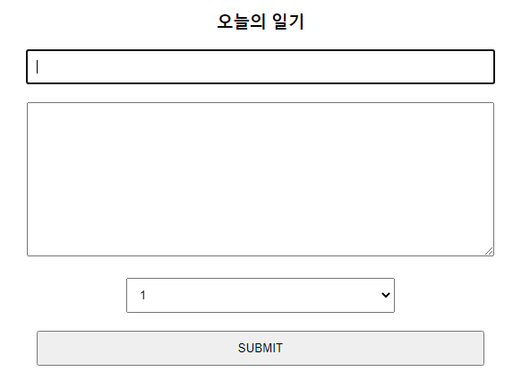

##### `useRef` 를 활용하면 HTML DOM 요소에 접근이 가능하다!!!




```js
import React, { useState } from 'react'

const DiaryEditor = () => {
  const [ state, setState ] = useState({
    author : '',
    content: '',
    emotion : 1,
  })

  const handleChangeState = (e) => {
    setState({
      ...state,
      [e.target.name] : e.target.value
    })
  }

  const handleSubmit = () => {
    if(state.author.length < 1) {
      alert('작성자는 최소 1글자 이상 입력해주세요!')
      // focus
      return
    }

    if(state.content.length < 5){
      alert('일기 본문은 최소 5글자 이상 입력해주세요!')
      // focus
      return
    }

    alert('저장 성공!')
  }

  return (
    <div className = "DiaryEditor">
      <h3>오늘의 일기</h3>
      <div>
        <input 
          name = "author"
          value={ state.author}
          onChange={handleChangeState}
        ></input>
      </div>
      <div>
        <textarea
          name = 'content' 
          value = { state.content}
          onChange={handleChangeState}
        >
        </textarea>
      </div>
      <div>
        <select name='emotion'
          value={state.emotion}
          onChange={handleChangeState}>
          <option value={1}>1</option>
          <option value={2}>2</option>
          <option value={3}>3</option>
          <option value={4}>4</option>
          <option value={5}>5</option>
        </select>
      </div>
      <div>
        <button onClick={ handleSubmit}>SUBMIT</button>
      </div>
    </div>
  )
}

export default DiaryEditor;
```


----




```js
import React, { useRef, useState } from 'react'

const DiaryEditor = () => {
  // 여기서 useRef를 활용해 input 태그를 선택해준다.
  const authorInput = useRef()
  const contentInput = useRef()

  const [ state, setState ] = useState({
    author : '',
    content: '',
    emotion : 1,
  })

  const handleChangeState = (e) => {
    setState({
      ...state,
      [e.target.name] : e.target.value
    })
  }

  const handleSubmit = () => {
    if(state.author.length < 1) {
      // focus
      // 기존의 alert 메세지를 없애고
      // 조건을 못 맞췄을때 제출하기 버튼을 누르면 자동으로 focus될 수 있도록 해준다.
      authorInput.current.focus()
      return
    }

    if(state.content.length < 5){
      // focus
      contentInput.current.focus()
      return
    }

    alert('저장 성공!')
  }

  return (
    <div className = "DiaryEditor">
      <h3>오늘의 일기</h3>
      <div>
        <input 
      	  // ref로 해당 html 요소 선택해주기
          ref={authorInput}
          name = "author"
          value={ state.author}
          onChange={handleChangeState}
        ></input>
      </div>
      <div>
        <textarea
          ref={contentInput}
          name = 'content' 
          value = { state.content}
          onChange={handleChangeState}
        >
        </textarea>
      </div>
      <div>
        <select name='emotion'
          value={state.emotion}
          onChange={handleChangeState}>
          <option value={1}>1</option>
          <option value={2}>2</option>
          <option value={3}>3</option>
          <option value={4}>4</option>
          <option value={5}>5</option>
        </select>
      </div>
      <div>
        <button onClick={ handleSubmit}>SUBMIT</button>
      </div>
    </div>
  )
}

export default DiaryEditor;
```

- return 문 밖에서 `useRef`를 통해 빈 요소 만들어주고,
- 그 요소를 return 안의 HTML 문서 안에서 선택/ 지정해준뒤
- 각각의 함수 안에서 어떻게 적용할지 코드를 작성해준다.