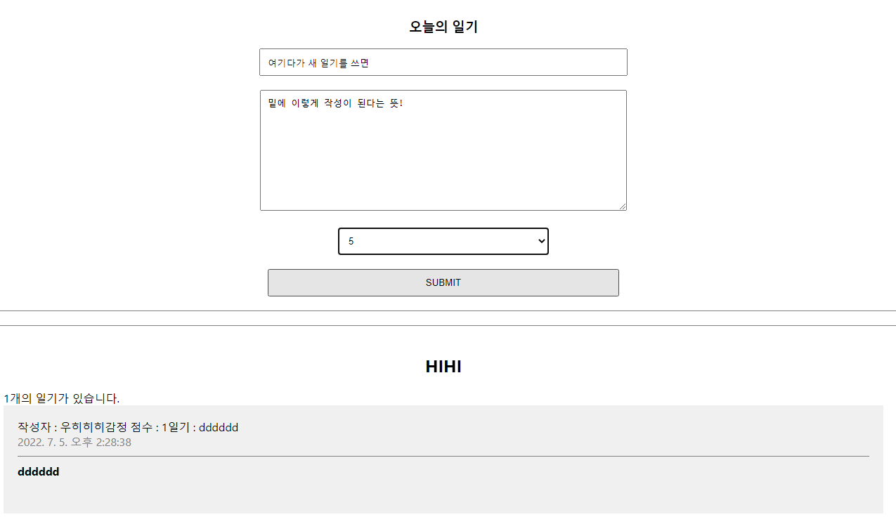

- React에서 같은 레벨 안에서는 데이터를 추가할 수 없다.


- React에서는 위에서 아래로만 데이터를 줄 수 있다.
- 하지만 우리는 DiaryEditor에서 데이터를 생성해 DiaryList로 건네주어야 한다!!!!


- DiaryEditor에서 데이터를 만들면 `CREATE` 이벤트가 발생하고, 그 이벤트는 위로 전달된다.
- 그리고 변화가 일어나면 data는 다시 아래로 흘러 DiaryList로 내려간다.


----




```js
// App.js

import './App.css';
import DiaryEditor from './DiaryEditor.js'
import DiaryList from './DiaryList.js'
import { useRef, useState } from 'react'

function App() {
  const [data, setData] = useState([])

  const dataId = useRef(0)

  const onCreate = (author,content,emotion) => {
    const created_date = new Date().getTime();
    const newItem = {
      author,
      content,
      emotion,
      created_date,
      id : dataId.current
    }
    // id 값이 계속 바뀌어야 하니 += 1 처리해준다.
    dataId.current += 1
    setData([newItem, ...data])
  }

  return (
    <div className="App">
      <DiaryEditor onCreate={onCreate}></DiaryEditor>
      <DiaryList diaryList={data}></DiaryList>
    </div>
  );
}

export default App;
```

```js
// DiaryEditor.js

import React, { useRef, useState } from 'react'

const DiaryEditor = ({onCreate}) => {
  const authorInput = useRef()
  const contentInput = useRef()

  const [ state, setState ] = useState({
    author : '',
    content: '',
    emotion : 1,
  })

  const handleChangeState = (e) => {
    setState({
      ...state,
      [e.target.name] : e.target.value
    })
  }

  const handleSubmit = () => {
    if(state.author.length < 1) {
      // focus
      authorInput.current.focus()
      return
    }

    if(state.content.length < 5){
      // focus
      contentInput.current.focus()
      return
    }

    onCreate(state.author, state.content, state.emotion)
    alert('저장 성공!')
    setState({
      author: '',
      content: '',
      emotion : 1
    })
  }

  return (
    <div className = "DiaryEditor">
      <h3>오늘의 일기</h3>
      <div>
        <input 
          ref={authorInput}
          name = "author"
          value={ state.author}
          onChange={handleChangeState}
        ></input>
      </div>
      <div>
        <textarea
          ref={contentInput}
          name = 'content' 
          value = { state.content}
          onChange={handleChangeState}
        >
        </textarea>
      </div>
      <div>
        <select name='emotion'
          value={state.emotion}
          onChange={handleChangeState}>
          <option value={1}>1</option>
          <option value={2}>2</option>
          <option value={3}>3</option>
          <option value={4}>4</option>
          <option value={5}>5</option>
        </select>
      </div>
      <div>
        <button onClick={ handleSubmit}>SUBMIT</button>
      </div>
    </div>
  )
}

export default DiaryEditor;
```

