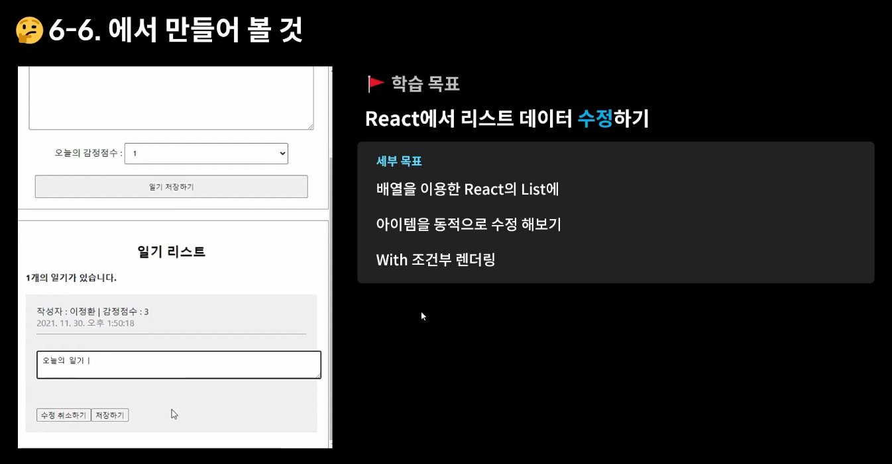
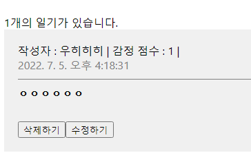
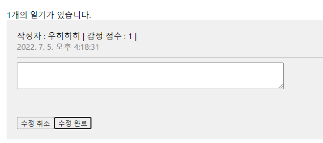

```js
// DiaryItem.js

import { useState } from 'react'

const DiaryItem = ({author, content, created_date, emotion, id, onRemove}) => {

  const [ isEdit, setIsEdit ] = useState(false)
  const toggleIsEdit = () => setIsEdit(!isEdit)

  const [ localContent, setLocalContent ] = useState(content)

  const handleRemove = () => {
    if(window.confirm(`${id}번째 일기를 삭제할 겁니까?`)) {
      onRemove(id)
    }
  }

  return (
    <div
     className="DiaryItem">
      <div className="info">
        작성자 : {author} | 
        감정 점수 : {emotion} | 
        <br></br>
        <span className="date">
          {new Date(created_date).toLocaleString()}
        </span>
      </div>
      <div className="content">
        {isEdit ? (<>
          <textarea
            value = {localContent}
            onChange={(e)=> setLocalContent(e.target.value)}
          ></textarea>
          </>) : (
          <>{content}</>
          )}
      </div>

      {isEdit ? (<>
        <button onClick={toggleIsEdit}>수정 취소</button>
        <button>수정 완료</button>
      </>) : (<>
        <button onClick={handleRemove}>삭제하기</button>
        <button onClick={toggleIsEdit}>수정하기</button>
      </>)}
     </div>
  )
}

export default DiaryItem;
```

- 위의 사진과 같이 toggle(on & off) 효과로 버튼을 나타내고 없앨 수 있다. 이는 삼항 연산자를 활용해 표현 가능
- 수정을 위해서 localContent, setLocalContent 부분을 useState(content)로 해서 이전에 작성했던 내용을 그대로 불러올 수 있도록 한다.


```js
// App.js

import './App.css';
import DiaryEditor from './DiaryEditor.js'
import DiaryList from './DiaryList.js'
import { useRef, useState } from 'react'

function App() {
  const [data, setData] = useState([])

  const dataId = useRef(0)

  const onCreate = (author,content,emotion) => {
    const created_date = new Date().getTime();
    const newItem = {
      author,
      content,
      emotion,
      created_date,
      id : dataId.current
    }
    dataId.current += 1
    setData([newItem, ...data])
  }

  const onRemove = (targetId) => {
    console.log(`${targetId}가 삭제되었습니다`)
    const newDiaryList = data.filter((it)=> it.id !== targetId)
    setData(newDiaryList)
  }

  const onEdit = (targetId, newContent) => {
    setData(
      data.map((it)=> it.id === targetId ? {...it, content:newContent} : it)
    )
  }

  return (
    <div className="App">
      <DiaryEditor onCreate={onCreate}></DiaryEditor>
      <DiaryList diaryList={data}
        onRemove={onRemove}
        onEdit={onEdit}
      ></DiaryList>
    </div>
  );
}

export default App;
```

- onEdit 이라는 함수를 만들어서 DiaryItem까지 props로 데이터를 전달해준다.
- 수정할 때 각 일기의 id와 내용을 받을 것이기 때문에 (targetId, newContent)를 받고, `map` 내장함수를 사용하여 각각의 id가 targetId와 같을 때(선택하게 되면) content부분만 수정해준다.

```js
// DiaryItem.js

import { useState , useRef } from 'react'

const DiaryItem = ({author, content, created_date, emotion, id, onRemove, onEdit}) => {

  const [ isEdit, setIsEdit ] = useState(false)
  const toggleIsEdit = () => setIsEdit(!isEdit)

  const [ localContent, setLocalContent ] = useState(content)
  const localContentInput = useRef()

  const handleRemove = () => {
    if(window.confirm(`${id}번째 일기를 삭제할 겁니까?`)) {
      onRemove(id)
    }
  }

  // 수정취소할 때 적용할 함수
  // content는 수정하지 않았으므로 다시 띄워주고,
  // 수정하기, 삭제하기 버튼을 다시 보여주기 위해 false 처리해준다.
  const handleQuitEdit = ()=> {
    setIsEdit(false)
    setLocalContent(content)
  }

  // useRef로 input 영역을 선택했음
  // 조건을 달아서 조건에 부합할 때(5글자 미만인 경우) focus하도록 지시
  const handleEdit = () => {
    if (localContent.length < 5) {
      localContentInput.current.focus()
      return 
    }

    if(window.confirm(`${id}번째 일기를 수정하시겠습니까?`)){
      onEdit(id, localContent)
      toggleIsEdit()
    }
  }

  return (
    <div
     className="DiaryItem">
      <div className="info">
        작성자 : {author} | 
        감정 점수 : {emotion} | 
        <br></br>
        <span className="date">
          {new Date(created_date).toLocaleString()}
        </span>
      </div>
      <div className="content">
        {isEdit ? (<>
          <textarea
            ref={localContentInput}
            value = {localContent}
            onChange={(e)=> setLocalContent(e.target.value)}
          ></textarea>
          </>) : (
          <>{content}</>
          )}
      </div>

      {isEdit ? (<>
        <button onClick={handleQuitEdit}>수정 취소</button>
        <button onClick={handleEdit}>수정 완료</button>
      </>) : (<>
        <button onClick={handleRemove}>삭제하기</button>
        <button onClick={toggleIsEdit}>수정하기</button>
      </>)}
     </div>
  )
}

export default DiaryItem;
```

