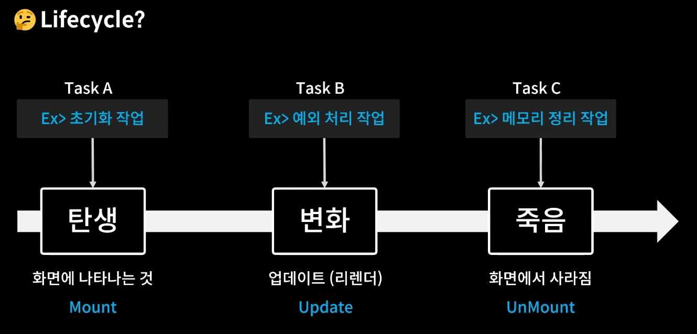
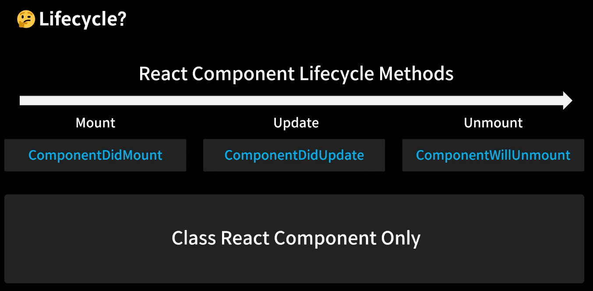
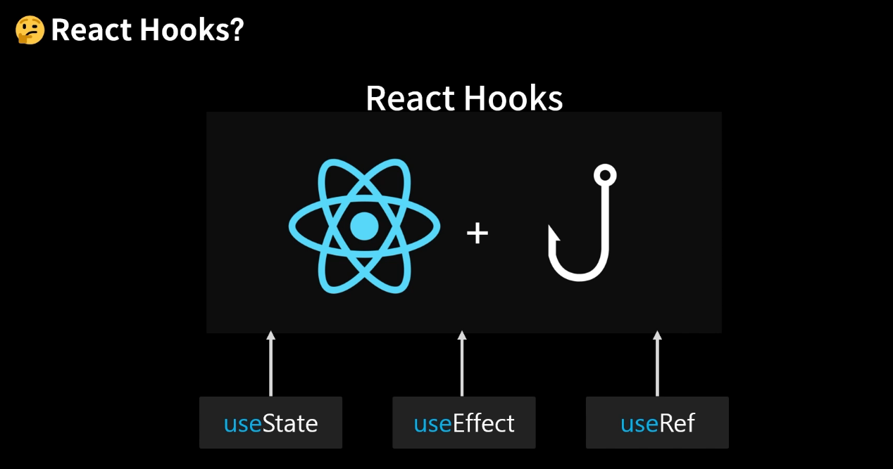
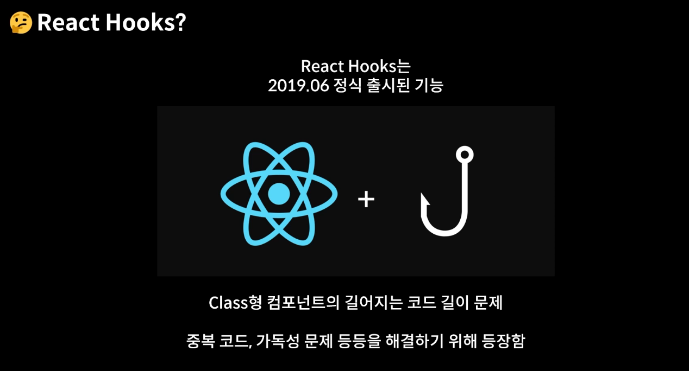
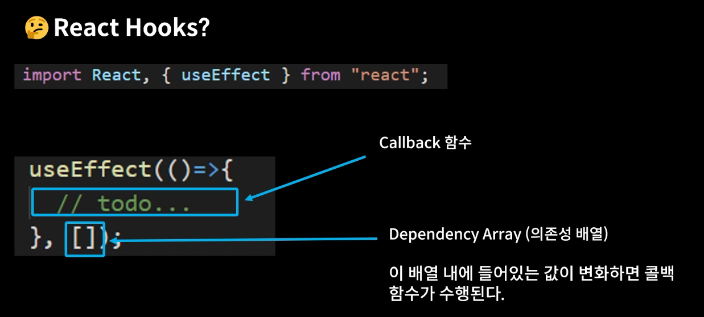
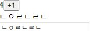
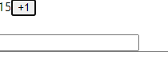
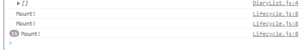

👉 `useEffect` 함수는 리액트 컴포넌트가 렌더링 될 때마다 특정 작업을 실행할 수 있도록 하는 Hook이다.

👉 즉, component가 mount 됐을 때, unmount 됐을 때, update 됐을 때 특정 작업을 처리할 수 있다.

```js
useEffect(()=> {
    console.log('마운트 될 때만 실행된다')
}, [])

useEffect(()=> {
    console.log('렌더링 될 때마다 실행된다.')
})

useEffect(()=> {
    console.log(name)
    console.log('업데이트 될 때 실행된다')
}, [name])

useEffect(()=> {
    console.log('effect')
    console.log(name)
    
    // 클린업 함수 반환(return 뒤에 나오는 함수이며 useEffect에 대한 뒷정리 함수)
    // 언마운트 될 때만 cleanup 함수를 실행하고 싶을 때 두 번째 파라미터로 빈 배열을 넣는다.
    // 특정값이 업데이트되기 직전에 cleanup 함수를 실행하고 싶을 때 deps 배열안에 검사하고 싶은 값을 넣어준다.
    return () => {
        console.log('cleanup')
        console.log(name)
    }
}, [])
```


----




```js
import React, {useEffect, useState} from 'react'

const Lifecycle = () => {
  const [count, setCount ] = useState(0)
  const [text, setText ] = useState('')

  const plusCount = () => {
    let res = setCount(count + 1)
    return res
  }

  const typeText = (e) => {
    let res = setText(e.target.value)
    return res
  }

  return (
    <>
      <div>
        {count}
        <button onClick={plusCount}>+1</button>
      </div>
      <div>
        {text}
        <br></br>
        <input onChange={typeText}></input>
      </div>
    </>
  )
}

export default Lifecycle
```

- 일단 `useEffect`를 실습하기 위해 버튼과 인풋 예제를 만들었다.


----


> Mount 되는 시점을 확인해보자





```js
import React, { useEffect, useState} from 'react'

const Lifecycle = () => {
  const [count, setCount ] = useState(0)
  const [text, setText ] = useState('')

  // deps에 설정된 값이 변화할 때마다 useEffect가 적용된다.
  // 여기서는 빈 배열을 넣었기 때문에 'Mount!'가 호출되지 않는다.
  useEffect(()=> {
    console.log('Mount!')
  },[])

  // 여기서는 deps를 작성하지 않았기 때문에 뭐 하나 클릭할 때마다 업데이트가 된다.
  useEffect(()=> {
    console.log('Update!!!!')
  })

  // 마찬가지로 deps에 count를 작성해주었기 때문에
  // count가 변화할 때마다 업데이트가 뜰 것이다.
  useEffect(()=> {
    console.log(`count is updated, ${count}`)
    if(count>5) {
      alert('카운트가 5 초과라서 다시 0으로 초기화할것임') 
      setCount(0)
    }
  }, [count])

  const plusCount = () => {
    let res = setCount(count + 1)
    return res
  }

  const typeText = (e) => {
    let res = setText(e.target.value)
    return res
  }

  return (
    <div style={{padding:20}}>
      <div>
        {count}
        <button onClick={plusCount}>+1</button>
      </div>
      <div>
        {text}
        <br></br>
        <input onChange={typeText}></input>
      </div>
    </div>
  )
}

export default Lifecycle
```

```js
const UnmountTest = () => {
  useEffect(()=> {
    console.log('Mount!!!!')

    return ()=> {
      // Unmount 시점에 실행되게 됨
      console.log('Unmount!!!!!!!!!')
    }
  },[])

  return (
    <div>
      Unmount Testing Component
    </div>
  )
}
```

- useEffect를 사용하면 어떤 시점에 적용되는지 

