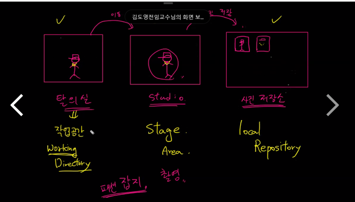
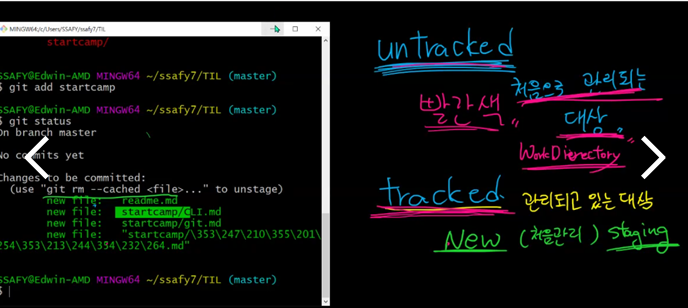
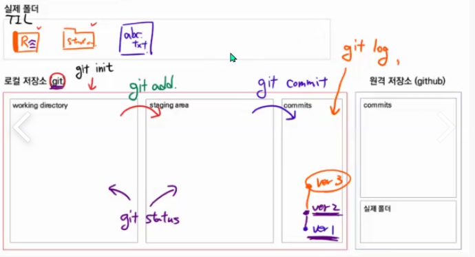

<h1>🌱TIL (Today I Learned)</h1>

### GIT 사용법

1. [Markdown](startcamp/마크다운md)
2. [CLI](startcamp/CLI.md)

3. [GIT 예시](startcamp/git 예시.md)

4. [GIT 사용법](startcamp/Git.md)

-----

### PYTHON

1. [변수(Variable)](Python/변수(Variable).md)

2. [제어문](Python/제어문(조건문, 반복문).md)
3. [함수(Function)](Python/함수(function).md)
4. [데이터 구조(Data Structure)](Python/데이터 구조(Data Structure).md)
5. [모듈(Module)](Python/모듈(Module).md)
6. [에러/예외 처리](Python/에러,예외 처리(Error,Exception Handling).md)
7. [OOP](Python/OOP.md)

-----

### WEB

1. [HTML](Web/HTML.md)
2. [HTML 실습](Web/HTML+.md)
3. [Grid](Web/grid.md)

----

### ALGORITHM

1. [Bubble/Counting Sort](Algorithm/Bubble,Counting_sort.md)
2. [List배열](Algorithm/List.md)
3. 

---

### DJANGO

1. [Django 실행](Django/Django.md)
2. [Django detail](Django/Django detail.md)
2. [Model](Django/Model.md)

