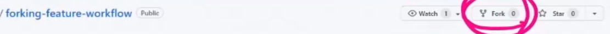

### 1. Feature Branch Workflow

> 저장소의 소유권이 있는 경우

- 각각의 브랜치에서 각자의 작업을 진행한다.
- 작업 진행한 후 push를 할 때는 `git push origin master`이라는, origin이라는 브랜치를 푸쉬하는 명령어를 써왔었다.  하지만 이제는 이러한 브랜치를 푸쉬해야한다!!!!! => `git push origin feature/login`
- 이렇게 푸쉬를 각각 하면 3개의 브랜치가 푸쉬될 것이다.

- 위에서 병합을 하면 병합 완료된 밑의 브랜치들은 삭제된다. 

- 이후 원격 저장소에서 병합 완료된 로컬 브랜치를 삭제한다.
  - 밑의 feature/login, feature/signup, feature/profile을 삭제해준다는 뜻이다.

-----

- 깃헙에서 레파지토리를 생성(`branch-feature-flow`라고 가정) 후 collaborator에서 함께 작업할 사람의 아이디를 추가한다.
- 브랜치를 생성하면서 이동하는 방법 => `git switch -c <브랜치 이름>` 으로 한다.
  - 예시로, `git switch -c feature/login` 이라는 명령어를 통해 `feature/login`이라는 브랜치로 생성, 변경된 후 여기서 작업을 한다.
- 작업을 끝낸 후 master를 푸쉬하는 것이 아니라 내가 작업한 브랜치를 푸쉬한다!!! `git push origin feature/login`이라는 명령어를 작성해준다.
- 이렇게 작업을 진행하면 내 git에 `compare & pull request`라는 버튼이 생성된다. 
  - 이 버튼을 누르면 메세지를 남기는 것과 함께 pull request를 보낼 수 있다. 이렇게 되면 팀장과 다른 팀원들의 git 화면에도 pull request가 대기가 됨을 확인할 수 있다.
- 팀장의 화면에서 `commits` 버튼과 `files changed` 버튼에서 변경사항 확인 가능. `files changed`에서 새로운 코드 제안이 가능하다. 
- 팀원은 팀장의 새로운 코드 제안(리뷰)을 받고 다시 comment를 받을 수 있고, 밑에 `commit suggestion`이라는 버튼을 누르면 그 코드가 반영이 된다. 이렇게 되면 commit을 한 번 더 하게 된 것이므로 commit이 총 두 개가 된다.

- 다 해서 `merge pull request`를 누르면 모든 commit들을 합치는 것이다.
- 깃헙이 merge가 되면 브랜치들이 필요가 없어지므로 `delete branch`를 눌러주면 된다(`restore branch` 버튼을 통해 새로 살리는 것도 가능!)
- 이까지 다 하면 팀원들에게 master branch가 업데이트되었다고 알려주어야 한다.
- 다시 `git switch master` 명령어를 통해 master 브랜치로 돌아오고, `git pull origin master`을 통해 생성했던 파일을 받아준다.
- 이후 필요없어진 feature/login 브랜치를 없애기 위해 `gir branch -d feature/login` 명령어를 터미널창에 입력해준다.
- 이것이 하나의 사이클이 끝이 난 것!!!!!!!!!!!!!!!!!!!!!!!!!!!!!!!!!!

-------

### 2. Forking Workflow

> 소유권이 없는 원격 저장소가 있을 때

- 이번에는 깃 계정에 collabo를 통해 팀원을 추가하지 않는다! 대신 아래와 같이 깃창의 상단을 보면 `fork` 버튼이 있는데 이를 통해 남의 프로젝트를 내 깃헙에 포크해오는 것이다.

- 현재 `git remote -v`를 통해 저장된 브랜치를 확인하면 포크해온 주소까지 뜬다.
- git clone을 통해 포크해온 주소를 열어주고, `git remote add <다른 이름> <원본 저장소 주소>` 명령어를 통해 origin이 아닌 다른 이름으로 주소를 저장해준다.
- `git switch -c (feature/login)` 명령어를 통해 브랜치를 바꿔주고 파일을 만들고 push까지 해준다. 여기서 push는 원본으로 하면 안되고 복제한 주소에 push해주는 것이다. 그래서 `git push origin (feature/login)`으로 푸쉬해준다. 복제해왔으니 내 것이기 때문!!
- 이후 내 git 계정으로 들어가면 `compare& pull request` 버튼이 생기는데, 여기서도 메시지를 작성해서 보내준다.
- 이제 원본을 가진 계정주가 깃 계정에 들어가면 `pull request` 알림이 생성된다. 확인하면 내가 작성한 메시지와 함께 코드가 뜨는데, 이 이후 과정은 위 1번 과정과 똑같다. merge 컨펌을 하고 master가 반영된 것을 확인한 후, 다시 내 브랜치에서 master 브랜치로 돌아오고(`git switch master`) 