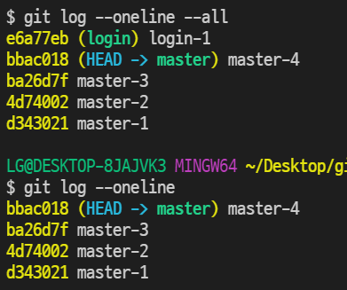
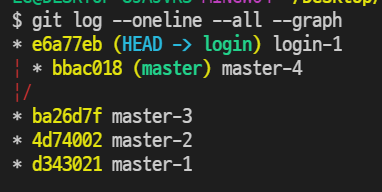
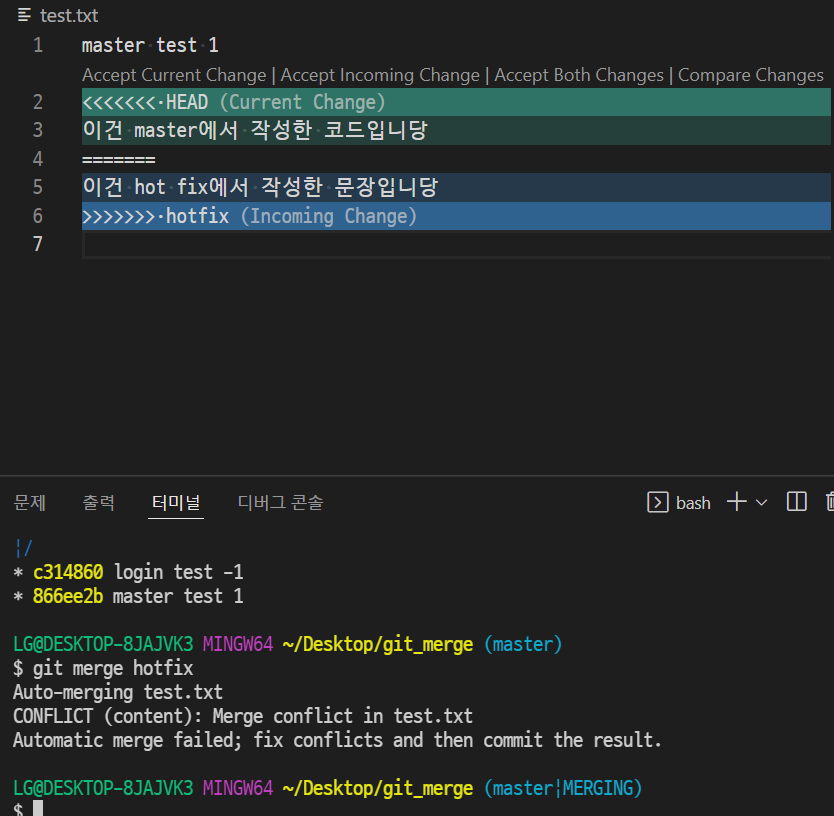

## ✅ Git 간단한 명령어

- `git branch` : 브랜치 목록 확인

- `git branch 브랜치이름` : 새로운 브랜치 생성
- `git branch -d 브랜치이름` : 특정 브랜치 삭제(병합된 브랜치만 삭제)
- `git branch -D 브랜치이름` : 브랜치 강제 삭제
- `git switch 브랜치이름` : 해당 브랜치로 이동
- `git switch -c 브랜치이름` : 브랜치를 새로 생성과 동시에 이동

git log --oneline : 현 브랜치의 log 상태를 한 줄에 보여준다.

git log --oneline -- all : 다른 브랜치의 commit 상황까지 다 보여준다.

git log --oneline --all --graph : 브랜치 상태를 시각적으로 보여준다.(신기!!)

#### merge(병합)

`git merge 병합할 브랜치 이름`

- merge하기 전에 일단 다른 브랜치를 합치려고 하는, 즉 메인 브랜치로 switch 해야함

1. fast-forward

2. 3-way merge(merge commit)
3. merge conflict

- merge하는 두 브랜치에서 같은 파일의 같은 부분을 동시에 수정하고 merge하면 git은 해당 부분을 자동으로 merge해주지 못함.
- 반면 동일 파일이더라도 서로 다른 부분을 수정했다면 conflict 없이 자동으로 merge commit 된다.

